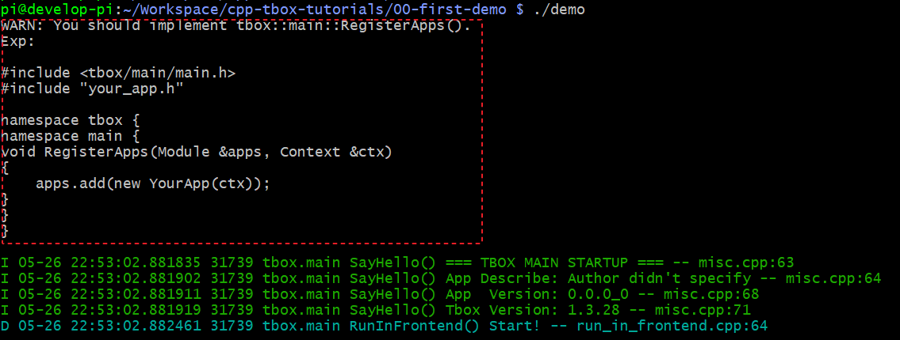

# 写一个自己的 Module

如果你很细心，你会发现上面的程序在运行之前有一堆提示:  
  
这是 tbox.main 框架在运行时，发现它没有任何可以运行的负载，向开发者打印的提示。  
它希望开发者自己去定义一个自己的模块，如 `YourApp`(名字开发者自己取)，然后按上面的方式注册到 tbox.main 框架上。  
接下来，我们按第一个课程的提示，编写自己的 `Module`。  

创建 app\_main.cpp 文件，内容如下:  
```c++
#include <tbox/main/module.h>

class MyModule : public tbox::main::Module {
  public:
    explicit MyModule(tbox::main::Context &ctx) : tbox::main::Module("my", ctx) {}
};

namespace tbox {
namespace main {
void RegisterApps(Module &apps, Context &ctx) {
  apps.add(new MyModule(ctx));
}
}
}
```
然后再修改 Makefile，将 app\_main.cpp 加入到源文件中。  
见：[Makefile](01-first-module/Makefile)  

[示例工程目录](01-first-module)  

编译执行:`make && ./demo`，运行结果:  
   
这次可以看到，它没有再打印之前的提示了。说明我们写的`MyModule`已经生效了。

但是，单从日志上看，我们并不能看出我们写的 MyModule 有真的运行起来。  
接下来，我们再往 `MyModule` 中添加自定义的功能。让它在运行的过程中打印一点日志。    

[示例工程目录](02-first-module)  

```c++
class MyModule : public tbox::main::Module {
  public:
    explicit MyModule(tbox::main::Context &ctx) : tbox::main::Module("my", ctx) { }
    virtual ~MyModule() { }

    virtual bool onInit() override { LogTag(); }
    virtual bool onStart() override { LogTag(); }
    virtual void onStop() override { LogTag(); }
    virtual void onCleanup() override { LogTag(); }
};
```

我们重写了`MyModule`类的四个虚函数:`onInit()`，`onStart()`，`onStop()`，`onCleanup()`，并在每个虚函数中都添加了`LogTag()`日志打印。  
为了能使用`LogTag()`日志打印函数，我们还需要添加`#include <tbox/base/log.h>`。  
完成之后执行 `make`。在编译的时侯，我们看到了一条编译警告:   
  
它是在说我们程序没有指定日志的模块名。这仅是一条警告，我们可以忽略它。不过，我建议你在 Makefile 的`CXXFLAGS`定义中添加`-DLOG_MODULE_ID='"demo"'` 进行定义。  

编译后执行，然后按 ctrl+c 退出程序，完整的日志打印效果:  
    

可以看到，上面的出现了几条紫色的日志，这正是 LogTag() 打印的。  
在程序启动的时候，我们看到依次执行了`onInit()`与`onStart()`。在我们按 ctrl+c 时，程序退出时也依次执行了`onStop()`与`onCleanup()`。  
在真实的项目中，我们就通过重写 `tbox::main::Module` 中定义的虚函数与构造函数、析构函数来实现模块的功能的。  
我们需要在这些函数里实现什么功能呢?

| 函数 | 要实现的行为 | 注意事项 |
|:-|:-|:-|
| 构造函数 | 初始化自身的成员变量，包括new对象 | 不要做可能失败的行为。<br/>如果有，放到 `onInit()` 去做 |
| `onFillDefaultConfig()` | 往js对象中填写内容，填写本模块所需的默认参数 | 仅对 js 进行设置，不要做其它的事务 |
| `onInit()` | 根据js对象传入的参数，进行初始化本模块、与其它的模块建立关系、加载文件等 | 
| `onStart()` | 令模块开始工作 |  |
| `onStop()` | 令模块停止工作，是 `onStart()` 的逆过程 |  |
| `onCleanup()` | 解除与其它模块之间的联系、保存文件，是 `onInit()` 的逆过程 |  |
| 析构函数 | 释放资源、delete对象，是构造的逆过程 | 不要做有可能失败的行为。<br>如果有，放到 `onCleanup()` 去做 |

至于为什么要设计这四种虚函数，以及它们之间的差别，详见 [cpp-tbox/module/main/module.h](https://gitee.com/cpp-master/cpp-tbox/blob/master/modules/main/module.h) 中的解析。  

Q：我看到上面有 `new MyModule(ctx)`，但我没有看到有对它的`delete`语句，是忘了写吗?  
A：tbox.main 架框会自己管理已注册`tbox::main::Module`派生类的生命期，一旦它被`add()`上去了，它的生命期就不需要开发者操心。

-------
[[返回主页]](README.md)
