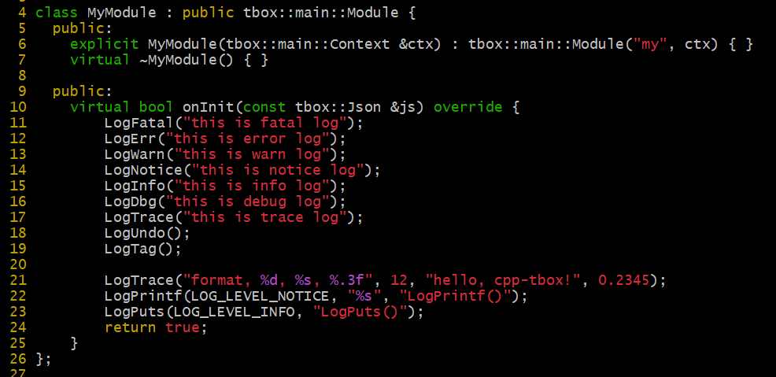
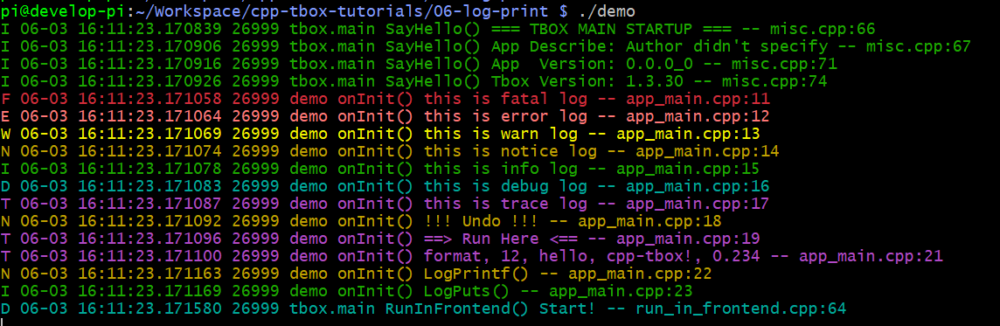
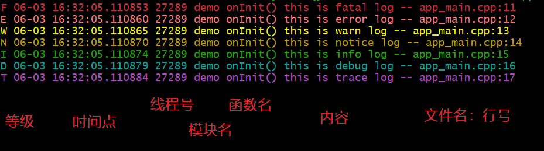

# 日志的打印

调试日志是程序中一个比较重要的一部分。通常，我们在开发程序的时候，会直接使用 `printf()` 或 `std::cout`,`std::cerr` 在终端上打印日志。但这样打印，有很多不足：1）面日志格式混乱；2）能提供的调试信息不够充分；3）输出的方式太过单一；4）没有日志等级筛选功能。  
因此，我们会去寻找开源的日志系统库，如：spdlog, glog, log4cxx，来满足日志打印需求。  

好在，当你使用 tbox.main 框架时，你根本就不需要为日志打印而发愁，因为它自带日志打印系统。你直接用就可以了。其它的不需要你关心。  

日志等级有：  
|值|等级|名称|显示颜色|
|:-|:-|:-|:-|
|0|FATAL|代码错误|暗红|
|1|ERROR|错误|红|
|2|WARN|警告|黄|
|3|NOTICE|注意|淡黄|
|4|INFO|信息|绿|
|5|DEBUG|调试|淡蓝|
|6|TRACE|跟踪|紫|

日志打印函数有：  
|函数|等级|用途|
|:-|:-|:-|
|`LogFatal(fmt,...)`|FATAL|打印程序代码级的错误，比如：程序崩馈，通常不会使用到|
|`LogErr(fmt,...)`|ERROR|打印导致业务完全不可用的严重错误。区别于FATAL，指的是非程序级错误，比如配置文件打不开|
|`LogWarn(fmt,...)`|WARN|打印影响部分功能的错误。区别于ERROR，这种错误不整响主要功能|
|`LogNotice(fmt,...)`|NOTICE|打印外部因素引起的轻微异常，这种异常不会影响功能，但需要注意。如对方的协议格式错误、版本不一致|
|`LogInfo(fmt,...)`|INFO|打印与外部交互的信息，用于鉴别问题是外部的，还是内部的|
|`LogDbg(fmt,...)`|DEBUG|打印内部模块之间的信息，用于鉴别问题是属于内部的哪个模块的|
|`LogTrace(fmt,...)`|TRACE|打印临时查问题所需的日志信息|
|`LogUndo()`|NOTICE|标记有未实现的功能，通用创建一个空函数时，就会放置一个LogUndo()|
|`LogTag()`|TRACE|用于打印运行标记，观察程序有没有运行过标记位置|
|`LogPrintf(level,fmt,...)`||在参数中指定等级打印格式化日志|
|`LogPuts(level,text)`||在参数中指定等级打印字符串日志|

详见 [log.h](https://gitee.com/cpp-master/cpp-tbox/blob/master/modules/base/log.h)

下面，我们来实际操作一下，在MyModule的onInit()尝试所有的日志打印函数：  

[示例工程目录](06-log-print/)  

编译执行效果：  

只要运行，我们就能在终端上就可以看到日志打印了。  
与常规的日志打印一样，一条日志记录打印一行。每一条记录都有以下信息：  
  
日志的时间点精确到微秒，有线程号，函数名、文件及行号，对调试非常有帮助。

Q: 日志除了打印到终端，还能输出到别的地方吗？  
A: 日志系统有三种输出方式：stdout(终端)、syslog、file。在不指定的情况下，默认只输出到stdout。如果需要，可以通过参数分别对这三种输出方式进行配置。这个后面讲参数的时候详细介绍。

-------
[[返回主页]](README.md)
