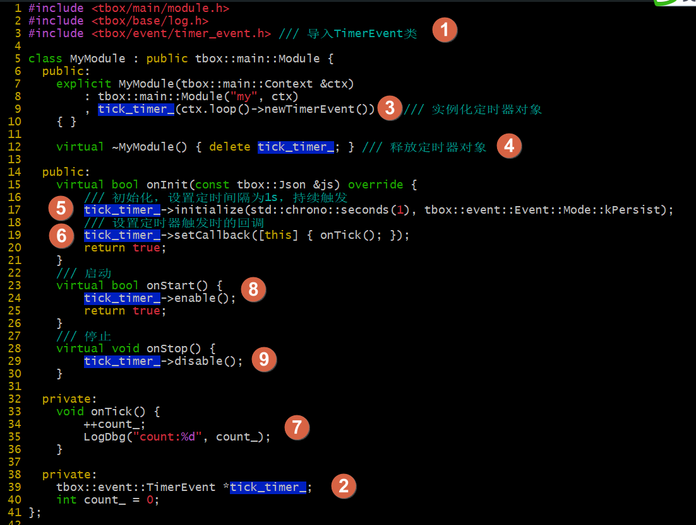
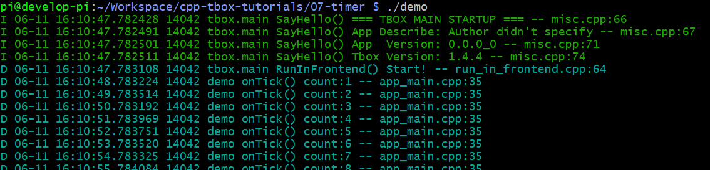

# 定时器事件

在基于事件的编程中，sleep() 或 delay() 这类阻塞性的函数是不能使用的。替而代之的是定时器。  
定时器，是基于事件编程中常见的组件。它可以实现：  

- 每间隔指定时间执行指定的动作；
- 指定时间后执行指定的动作；

在 tbox.main 框架中，我们自己的模块可以通过构造通传入的 `ctx` 获取 `event::Loop` 对象。而 `event::Loop` 对象可以创建定时器事件、IO事件、信号事件。  

接下来，我们实现一个定时器的功能：
  

实现步骤：  
(1) 包含头文件；  
(2) 添加成员变量 `tick_timer_` 用于存放定时器对象；  
(3) 在构造函数中实例化定时器对象；  
(4) 在析构函数中释放定时器对象；  
(5) 在 `onInit()` 中对定时器对象进行初始化，定时间隔1秒，持续触发；  
(6) 设置定时器的回调函数；  
(7) 实现 `onTick()` 函数；  
(8) 在 `onStart()` 中启动定时器；  
(9) 在 `onStop()` 中停止定时器；  

[示例工程目录](07-timer-event)  

编译后，执行效果：
  
可以看到定时器有定时触发。

如果想实现单次定时，将 L17 `initialize()` 的最后一个参数的 `kPersist` 改成 `kOneshot` 即可。

-------
[[返回主页]](README.md)
