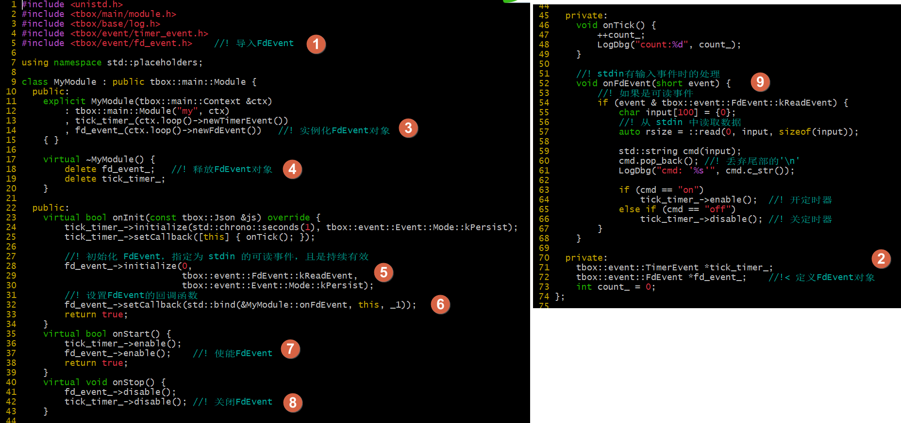
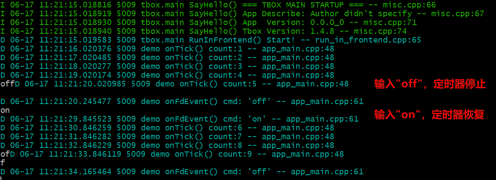

# IO事件

在基于事件的开发中，除了定期触发的事件，更多的是当外部发生了某件事件从而引发的事件。这些事件通常是通过文件描述符的可读可写时事件触发的。  
在 tbox 中，除了 TimerEvent，还有更重要的一种事件：FdEvent。它用于监听某个文件描述符的可读可写事件。  

下面，我们对上面的定时器时示例添加新的功能：当我们在终端上输入"off"时关闭定时器，当我们输入"on"打开定时器。  
为了实现这个功能，首先我们要实现从终端获取输入的数据。  
问：使用 `std::cin` 可以吗？这可是传统的方式。答：不可以，因为它是阻塞的。还记得我们前面提过 **不要阻塞** 的要求吗？所以不行。  
问：那开一个线程专门负责读终端的终入，将去控制定时器行不行呢？答：这也不是不行，只是这样就需要额外开一个线程了。  
这里，我们采用另一种更优的方案：创建一个stdin的文件描述符的`FdEvent`，令其监听stdin的可读事件。当stdin可读时，就调用`read(0,xx,yy)`将数据读出来，再处理。这样就不会阻塞了。  
如下更改：  
  
在(9)处定义了接收到stdin输入的处理过程。首先，检查一下是不是可读事件，如果是才处理。然后读0文件描述符，即stdin。将数据读到`buff`缓冲中。最后，根据输入的内容进行处理。

[示例工程目录](08-fd-event)

编译执行效果：  
  

[返回主页](README.md)
