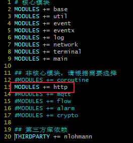
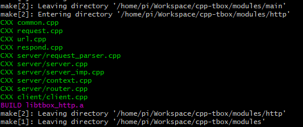
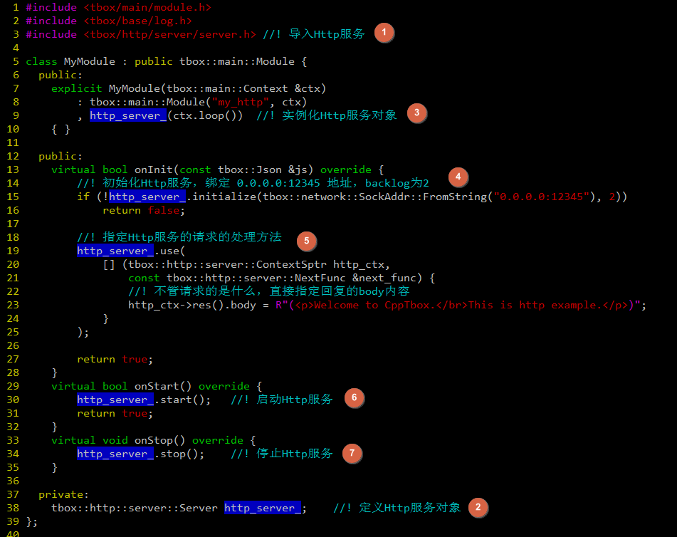
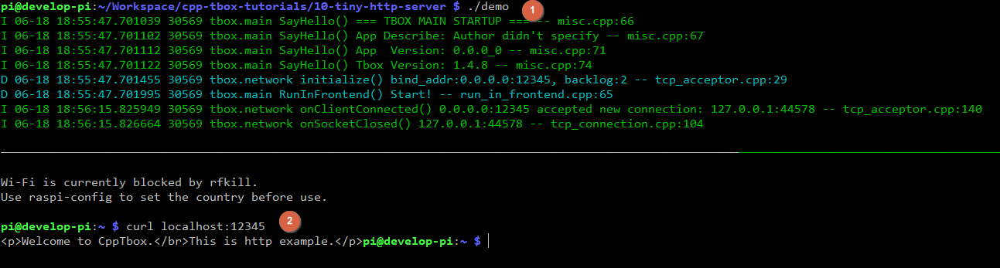

# HTTP服务

上面，我们分别演示了定时器事件`TimerEvent`、文件描述符事件`FdEvent`，以及信号事件`SignalEvent`的使用方式。然而，在真实的开发中，我们会优先使用tbox内部为我们实现的模块来实现我们的功能，比如：`TcpServer`, `TcpClient`, `Uart`, `BufferedFd`。这些模块的本质是在内部封装了对`TimerEvent`,`FdEvent`,`SignalEvent`的操作。  
下面，我们使用`http`模块来实现一个简单的http服务器。

由于tbox中的`http`模块不是默认开启的。我们需要通过修改`config.mk`文件打开它，并构建：  
  
然后再执行命令：`make 3rd-party modules RELEASE=1 STAGING_DIR=$HOME/.tbox`，进行构建：  
  
看到上面的输出，表示构建完成。接下来就可以使用 http 模块了。

为了演示，我们写一个非常简单的http服务程序，当我们访问它的时候，显示hello页面。  
  

[示例程序目录](10-tiny-http-server)

编译执行，使用 curl 测试，结果如下：  
  
  

