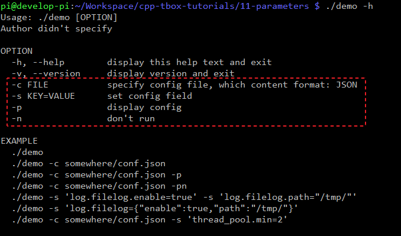
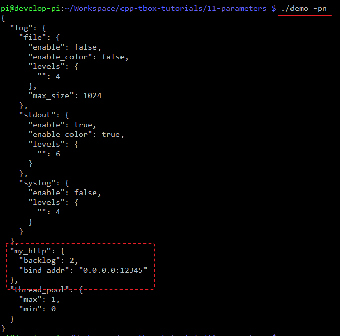
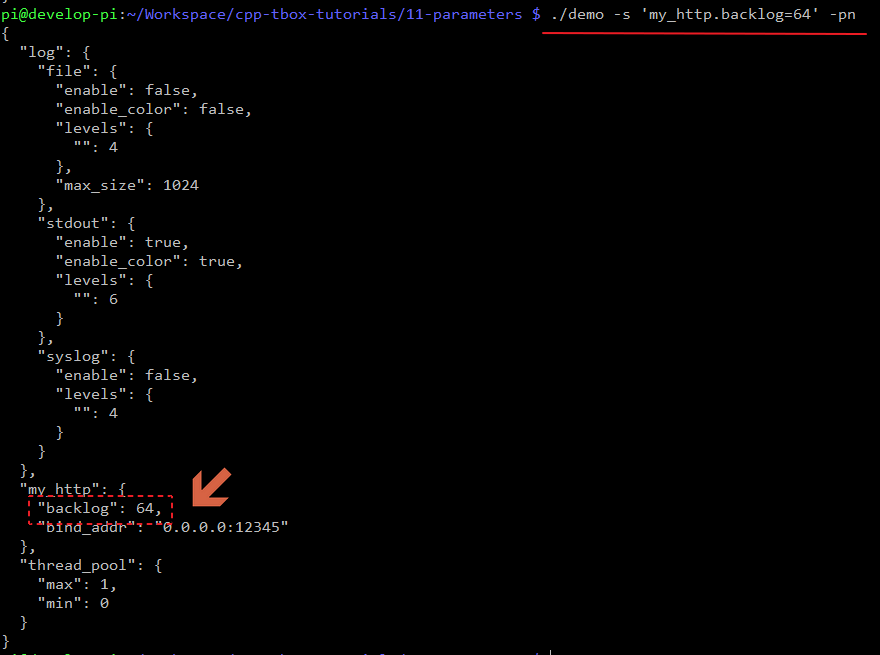
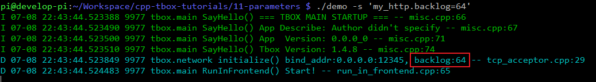
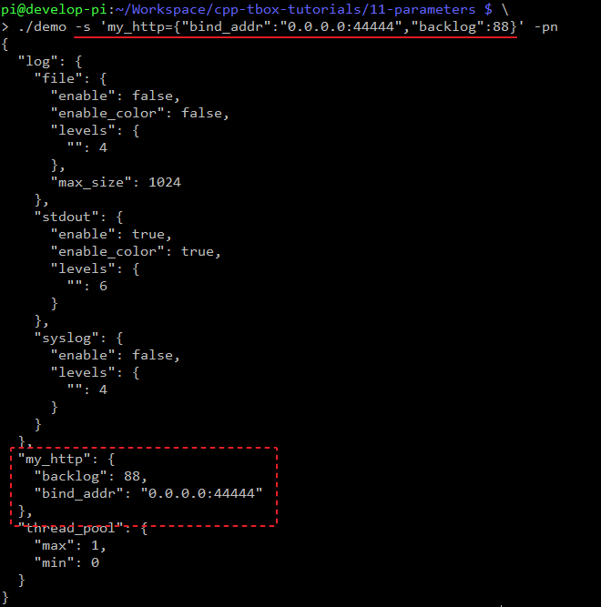
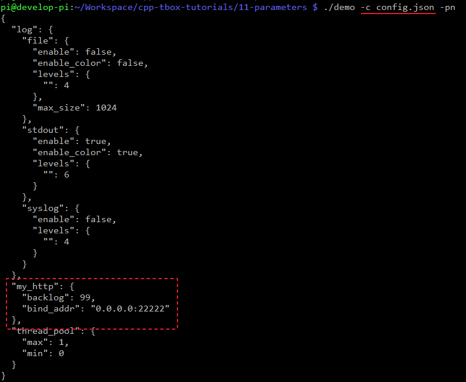

# 配置系统

配置可以用于不修改代码的情况下改变程序的行为。常规的配置传入有两种方式：(1)环境变量；(2)命令参数。而命令参数是用得最多的。  
在常规的开发中，我们可能这样传入命令参数的：  
```c
int main(int argc, char **argv) {
    if (argc >= 2) {
        ... /// 解析 argc 与 argv
    }
}
```
如果直接这么写会很麻烦，通常我们会使用 `getopt()` 或是 `getopt_long()` 来辅助解析。不过这还是会比较繁琐。每个要传入的参数都得写解析代码，而每个程序要传入的参数还各不相同。这样一来，每开发一个程序都要重写一次参数解析模块，每添加或删除参数也要修改，也比较繁琐。  
好在我们的tbox.main框架中内置了一套开放性的配置系统。它允许程序传入任何类型的参数（字串、数值、数组、对象），而且还支持将配置以文件的形式进行导入，让配置非常简单。本节我们将通过一系列的例子学习它的使用。  

## 实现自定义配置
在上面的http示例中，我们在 `onInit()` 中对http_server_对象进行了初始化，令其固定绑定 0.0.0.0 地址与12345端口，且backlog指定为2。将这些初始化参数写死在程序里不是一个好的主意。因为在真实的项目中，这些常常会变更。那能不能在运行的时候，通过配置进行指定呢？当然可以的。  
接下来，我们将使用配置系统，将绑定地址与端口，还有backlog通过配置传入。  

对 app_main.cpp 进行如下修改：  
  

(1) 由于接下来要对 JSON 进行操作，需要包含JSON相关的头文件；  
(2) 实现 `onFillDefaultConfig()` 函数。这个函数是用于让用户指定本模块运行的默认配置。可以看到，我们添加了两个字段"bind_addr"与"backlog"。这两个字段，在`onInit()` 会被使用到；  
(3) 在 `onInit()` 初始化函数中从 js 对象中提取出"bind_addr"与"backlog"；  
(4) 进行使用；  

编译后，不带参数执行。发现与上面节的没有什么变化，依旧绑定在 0.0.0.0:12345 端口上。  
接下来，我们给这个程序带上参数进行执行：`./demo -s 'my_http.bind_addr="0.0.0.0:44444"'`，执行效果：  
  
可见，HTTP服务的绑定端口变了，由之前的 12345 变成了 44444。这就说明我们设置的参数生效了。

接下来，我们来了解一下 tbox.main 框架配置系统的原理。  

## 原理介绍
由于不同的应用的配置是不同的，tbox.main 框架的配置系统摒弃了传统linux命令的传参方式，采用了JSON的方式。实现过程：  

在模块开始运行之前，tbox.main框架会创建一个叫 `js_conf` 的 JSON 对象。
```c++
Json js_conf;
```

然后为每个要运行的模块，以模块名在 `js_conf` 下创建一个子JSON `js_module`。  
并调用该模块的 `fillDefaultConfig(Json &js)` 方法，让模块根据自身功能的需要对 `js_module` 进行填充。
```c++
for (auto &m : modules) {
    Json &js_module = js_conf[m.name()];
    m.fillDefaultConfig(js_module);
}
```

然后，开始对参数进行逐一解析。 

如遇到 `-s 'a.b.c=xxxx'` 的参数，则将参数转换成这样的JSON：  
```json
"a":{
  "b":{
    "c":xxxx
  }
}
```
将它合并到 `js_conf` 中。
```c++
Json js_tmp = Parse(kv_string);
js_conf.merge_patch(js_tmp);
```

如遇到 `-c jsonfile.js` 的参数，则从 jsonfile.js 文件中导入JSON对象。  
然后，也合并到 `js_conf` 中。
```c++
Json js_tmp = Load(config_filename);
js_conf.merge_patch(js_tmp);
```

在解析完所有的参数后，就得到了一个能过参数修订后的 `js_conf` JSON对象。  

在对模块进行初始化的阶段，框架在初始化某个模块时，就会从js_conf取出对应模块名的js_module，在调用模块的`onInit()`时作为参数传入：  
```c++
for (auto &m : modules) {
    const Json &js_module = js_conf[m.name()];
    m.onInit(js_module);
}
```
于是，我们的各自模块在 `onInit()` 虚函数中，就得到了一个 JSON 对象的引用。通过获取其中的字段，我们就可以从中获得该模块的配置。  

上面的描述为了方便理解，本人刻意简化了其中的细节。具体实现，请阅读源码：

- [module/main/args.cpp](https://gitee.com/cpp-master/cpp-tbox/blob/master/modules/main/args.cpp)
- [module/main/run_in_frontend.cpp](https://gitee.com/cpp-master/cpp-tbox/blob/master/modules/main/run_in_frontend.cpp)

## 查看help
我可以通过执行 `./demo --help` 或 `./demo -h` 查看参数说明：  
  

- `-s 'KEY=VALUE'`，指定参数中某个字段的值；
- `-c FILE`，指定要导入参数的JSON文件；
- `-p`，打印配置数据，用于检查配置参数；
- `-n`，不运行，通常配置 `-p` 使用；

从上可以得知：如果我们想给名为"my_http"的模块指定参数，只需要使用 -s 或 -c 在`js_conf`中构建出以下的内容：
```json
{
  "my_http":{ ... }
}
```

明白了其中的原理并了解了参数之后，我们就能很好地理解上面示例的参数内容了。  
参数 `-s 'my_http.bind_addr="0.0.0.0:44444"'` 表示：设置 my_http.bind_addr 的参数值为 "0.0.0.0:44444"。于是，在 `MyModule::onInit()` 函数被执行时，所传入的js对象中存在"bind_addr"字段。它的值就是我们在执行参数中指定的 "0.0.0.0:44444"。  
那为什么是 "my_http.bind_addr" 而不是 "abc.bind_addr"？因为在 L10 构造中，指定了 MyModule 的名称为 "my_http"。当然，我们可以取其它名称。  

## 打印当前的配置
我们还可以通过在参数中 `-p`，让程序在执行前打印当前的配置。如果是仅仅看配置不运行程序，则直接加 `-pn`。  
尝试执行命令：`./demo -pn` 看到效果：  
  
这些就是执行 `./demo` 什么参数都不带的运行参数真实的内容。红色虚框标记处为 `my_http` 模块的参数。之所以他们存在，是因为我们为该模块实现了 `onFillDefaultConfig()` 方法，并在其中指定了默认参数。  
当然，我们还看到其它的参数项，如 `thread_pool`, `log`，这些我们在后面其它章节再讲述。  

就这样，我们常常使用 `-pn` 参数来检查我们的配置内容。如果有误，我们可以在正式运行之前对配置进行修正。修正之后，再去除 `-pn` 正式运行。
后面的例子，为了更直观地看参数对配置的修改效果，在执行时都带上 `-pn` 参数。  

我们尝试执行命令：`./demo -s 'my_http.backlog=64' -pn` 再看看效果：  
  
可见，`backlog`的值发生了变更。如果不再使用参数`-pn`那么我们可以看到它真正的运行效果：  
  
可见，`backlog`的值在运行中生效了。

## 一个`-s`设置多个参数
如果每设置一个参数都使用一个`-s`会使得参数很长，`-s`的数量很多。
也可以多个字段一起传，例如：`./demo -s 'my_http={"bind_addr":"0.0.0.0:44444","backlog":88}' -pn`  


## 导入配置文件
如果每次程序启动时都带这么长串的参数，是很繁琐的，也不直观。可以`-s`，我们可以采用`-c`导入配置文件。  
将参数写入到配置文件中，如 config.json
```json
{
  "my_http":{
    "bind_addr":"0.0.0.0:22222",
    "backlog":99
  }
}
```
然后在运行的时候使用 '-c config.json' 从配置文件中直接导入。
执行命令：`./demo -c config.json -pn`，看看效果：  
  

这样就可以很方便地一致性导入大批的参数，简洁，也简单。  
通常，对于固定不变的参数，我们使用导入配置文件的形式加载。对于临时需要调整的，就采用`-s 'a.b.c=xxx'`的形式。  

## 总结

- 使用 `-c` 导入配置文件；
- 使用 `-s` 修改配置项；
- 使用 `-pn` 打印配置项；

-------
[[返回主页]](README.md)
