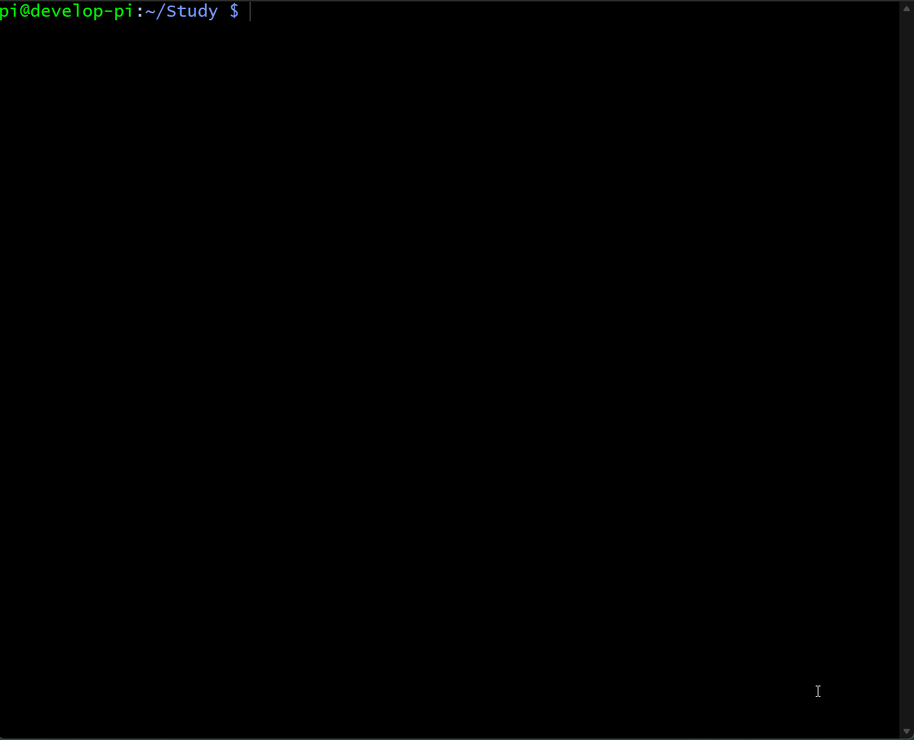
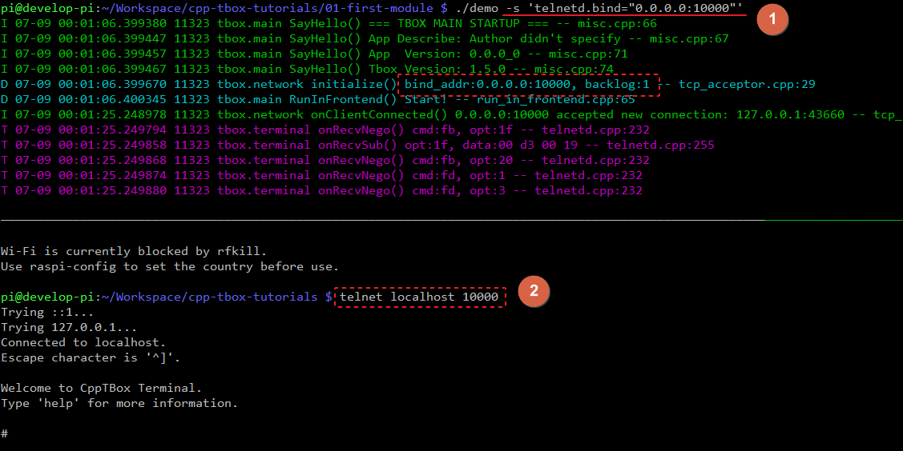
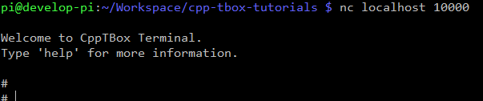
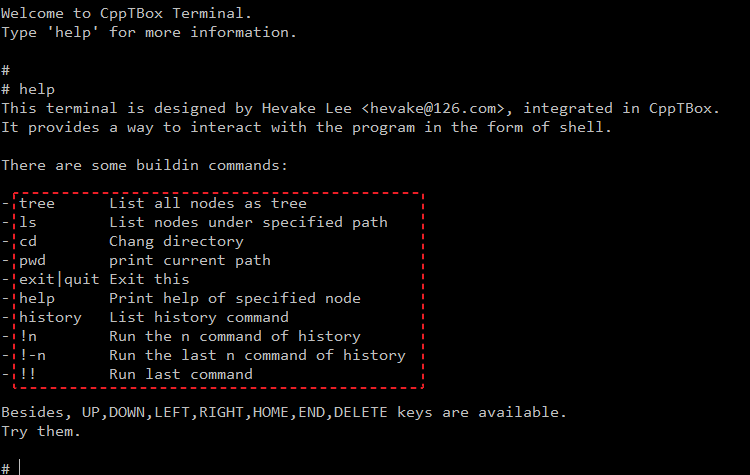
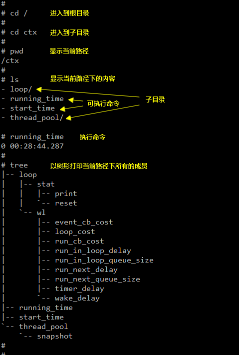
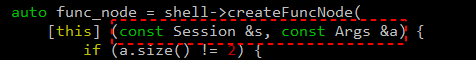
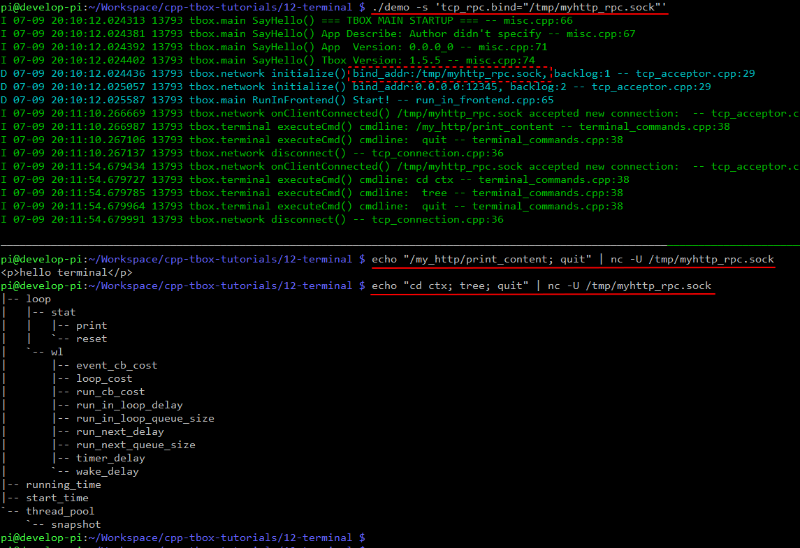

# 命令终端

我们的程序是持续运行着的。如果在它运行过程中出了点故障，通常只能通过日志分析大概现象。如果日志打印不充分，那么很难对问题进行精确的判定。如果有一个什么办法，可以在不中断程序的前提下，让程序把内部的成员变量通通都打印出来该多好啊。
除了上面的场景，还有其它的痛点：  
- 希望在程序运行过程中临时调整日志对某个模块的打印等级；  
- 希望在程序运行过程中，让程序模拟外部的某个事件，进行调试；  

总结下来，我们需要有一个方法，让程序在运行过程中执行某个特定的函数，并将执行的结果输出来。  
为此，我们想过很多办法：  
方法一：注册信号，让程序执行某个函数。这种方法简单，但一个信号只能指定执行一个函数；  
方法二：创建一个TCP或UDP的服务，接收字串并解释，执行命令对应的函数，并将结果直接返回；  
方法三：创建HTTP服务，接收POST请求，执行某个函数，将结果以回复的形式返回；  

在没有 terminal 之前，我使用最多的是方法二。每写一个程序，我都得建一张 cmd --> function 的表。一个命令对应一个函数。每当TCP接收到字串后，就从字串中提取出cmd与参数。再通过cmd从表中找出对应的 function，去执行对应的函数。这样的交互并不那么友好，也不具备很强的通用性。于是，我参考了 telnet 的交互协议，开发了 terminal 模块，并集成到了 tbox.main 框架中。从此 tbox.main 具备了调试终端的功能。  
效果如下：  
  

## 使能终端
默认情况下，命令终端并未启用，需要我们通过配置将其打开：`./demo -s 'telnetd.bind="0.0.0.0:10000"'`  
参数 `-s 'telnetd.bind="0.0.0.0:10000"'` 的意思是，将telnetd服务socket的绑定地址指定为 IP:0.0.0.0，端口：1000。于是 telnetd 服务就启用了：  
  
如上，我们在另一个窗口上执行 `telnet localhost 10000` 就能登陆上去。  
如果机器上没有 telnet 命令，还可以使用 nc 命令替代。主要功能一样，仅仅在体验上没有上下切换历史命令的功能罢了。  
  

## 常规操作
在 terminal 中有几个内置的命令，执行 help 命令可以看到：  
  
这些指令的功能与Linux对应的命令类似。最常用的有：ls, cd, tree, exit。大家可以逐一尝试执行一下。
  
它非常像Linux的Shell，符合了Linux的开发者的习惯。

## 实现自定义命令
接下来，我们尝试在模块中添加自己的命令。  
还是回到之前 HTTP 的示例上来。我们现在想实现HTTP返回的内容可通过终端进行查看与修改的功能。  
具体效果为：在终端的根目录下创建 my_http 目录，再在这个子目录下创建两个命令：print_content 与 set_content，功能顾名思义。像这样：  
```
`-- my_http
    |-- print_content
    `-- set_content
```

OK，我们将http的示例copy过来，在其原有基础上进行修改：  
  

(1) 引入与终端相关的头文件；  
(2) 添加 `content_` 成员变量；  
(3) 修改 http 的响应函数，使之将 `content_` 作为回复内容；  
(4) 调用 `initShell()` 函数，对终端进行初始化；  
(5) 实现 `initShell()` 函数的内容；  

在 `initShell()` 中进行了以下步骤：  
(1) 创建一个DirNode，并将它挂载到 "/" 目录上，命名为 "my_http"；  
(2) 创建一个FuncNode，并将它挂载到 "/my_http" 目录下，命名为 "print_content"；  
(3) 创建一个FuncNode，并将它挂载到 "/my_http" 目录下，命名为 "set_content"；  

其中在执行 `createFuncNode()` 时，需要传入一个函数对象。该函数对像需要传入两个参数：  
  

- `const Session &s`，会话对象，每个连接都是独立的。我们可以使用它的 `send(const std::string &txt)` 方法可以向终端回复内容；
- `const Args &a`，参数列表，本质上就是 `std::vector<std::string>`。需要说明的是：`a[0]` 永远是命令本身，后之才是参数内容。

编译后运行，再使用 telnet 登陆上去进行操作：  
  
使用浏览器也可以访问到：  


## 内置命令介绍
为了方便使用，tbox.main 已内置了一些常用的命令，方便使用者在运行时进行操控。  
我们在根目录下执行 `tree` 命令，终端会打印命令的树形结构。下面为本人在打印内容的基础上加了部分备注的内容：  
```
# tree
|-- ctx # ctx 相关
|   |-- loop # 主事件循环相关
|   |   |-- stat # 统计
|   |   |   |-- print # 打印统计
|   |   |   `-- reset # 重新开始统计
|   |   `-- wl   # 警告水位线（用于检查事件循环中是否存在阻塞）
|   |       |-- event_cb_cost          # 事件回调耗时阈值
|   |       |-- loop_cost              # Loop处理耗时阈值
|   |       |-- run_cb_cost            # 执行runNext(),runInLoop()与run()耗时阈值
|   |       |-- run_in_loop_delay      # runInLoop() 执行延迟阈值
|   |       |-- run_in_loop_queue_size # runInLoop() 最大排队等待长度
|   |       |-- run_next_delay         # runNext() 执行延迟阈值
|   |       |-- run_next_queue_size    # runNext() 最大排队等待长度
|   |       |-- timer_delay            # 定时器延迟阈值
|   |       `-- wake_delay             # 唤配延迟阈值
|   |-- running_time # 打印进程运行时长
|   |-- start_time   # 打印进程启动时间点
|   `-- thread_pool  # 线程池相关
|       `-- snapshot # 状态快照
|-- info # 信息打印
|   |-- app_ver    # 打印App版本信息，根据 GetAppVersion()
|   |-- build_time # 打印编译时间，根据 GetAppBuildTime()
|   |-- tbox_ver   # 打印Tbox版本信息，根据 GetTboxVersion()
|   `-- what       # 打印App描述信息，根据 GetAppDescribe()
`-- log  # 日志输出相关
    |-- file # 打印到文件的日志
    |   |-- enable       # 是否启用
    |   |-- enable_color # 是否根据日志等级渲染颜色
    |   |-- enable_sync  # 是否强制写入到存储器（部分文件系统会在内核中缓存，导致突然断电出现日志丢失情况）
    |   |-- set_level    # 指定模块的输出等级
    |   |-- set_max_size # 指定日志文件最大大小
    |   |-- set_path     # 指定日志文件的创建路径
    |   |-- set_prefix   # 指定日志文件的前缀
    |   `-- unset_level  # 与set_level对应，删除指定模块的日志等级
    |-- stdout # 打印到标准终端的日志
    |   |-- enable       # 是否启用
    |   |-- enable_color # 是否根据日志等级渲染颜色
    |   |-- set_level    # 指定模块的输出等级
    |   `-- unset_level  # 与set_level对应，删除指定模块的日志等级
    `-- syslog # 打印到syslog的日志
        |-- enable       # 是否启用
        |-- enable_color # 是否根据日志等级渲染颜色
        |-- set_level    # 指定模块的输出等级
        `-- unset_level  # 与set_level对应，删除指定模块的日志等级
```

## RPC接口
有时候，我们希望能在脚本中执行上面的这些终端命令，比如：自动化测试。  
为些，我还实现了 RPC 的功能。该功能可称为去除了打印欢迎词与提示符的功能，仅仅实现了解析命令，返回执行结果的功能。  

默认该功能未开启。与telnetd一样，可以通过配置开始。只需要在参数中加 `-s 'tcp_rpc.bind="xxxx"'` 即可，不需要对代码做任何的修改。  
我们尝试开启上面 http 服务的 RPC 功能。执行命令：`./demo -s 'tcp_rpc.bind="/tmp/myhttp_rpc.sock"'`  

  
```
echo "/my_http/print_content; quit" | nc -U /tmp/myhttp_rpc.sock
echo "cd ctx; tree; quit" | nc -U /tmp/myhttp_rpc.sock
```

需要注意的是：
- 命令之间以分号(;)进行分隔； 
- 所有的命令都需要以"quit"结束，否则socket不会断开；  
- 使用 echo 命令时，不要加 `-n`。  

有了这个工具，就可以让脚本替我们输命令了。这个工具解放了我们的双手。

-------
[[返回主页]](README.md)
