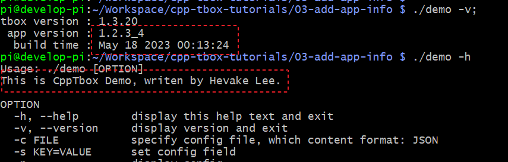

# 完善应用信息

上面，我们通过定义一个`MyModule`类，并重写其虚函数，实现了我们一个简单的应用。但仅仅是这么做是不完整的。  
当我们执行：`./demo -h` 时，当我们执行：`./demo -v` 或 `./demo --version` 时看到：  
  
这是因为，我们并没有对当前程序的描述、版本进行描述。我们可以通过在 app\_main.cpp 文件中加如下红框中的代码完善它：  
  
上面定义了三个函数：`GetAppDescribe()`、`GetAppVersion()`、`GetAppBuildTime()`，分析用于告析 tbox.main 框架当前应用的描述、版本号、编译时间点。  

[完整示例代码](03-add-app-info)

重新构建，再次执行 `./demo -v; ./demo -h` 效果：  


## 推荐的工程结构
在上面的示例中，我在 app_main.cpp 实现了所有的代码。而在真正的项目开发中，是不推荐这么做的。  
我们应该对 `app_main.cpp` 进行简单地拆分：  

- 将 `GetAppBuildTime()` 函数放到单独的文件中 build.cpp，并修改 Makefile 保证每次构建时，它都会被重新编译，以确保这个函数返回的时间与构建的时间一致；
- 将 `GetAppVersion()`, `GetAppDescribe()` 放置在 `info.cpp` 中，只要更新版本或应用描述才会改到它；
- 将 `RegisterApps()` 放置在 `apps.cpp` 中，以后基本不会再改它了；
- 创建你自己的应用目录，存放自定义的 `Module` 的实现，所有的业务相关的代码，都在这个目录下实现。

最终产生文件结构：  
```
.
├── apps.cpp    # 定义 RegisterApps()
├── build.cpp   # 定义 GetAppBuildTime()
├── info.cpp    # 定义 GetAppVersion(), GetAppDescribe()
├── Makefile
└── my          # 业务相关Module实现
    ├── app.mk
    ├── module.cpp
    └── module.h
```

[示例工程目录](04-normal-app-demo)

建议：在 my/ 目录下的所有代码，均以 `my` 作为顶层命名空间，以防在下一节的多Module情况下，命名空间污染。  


