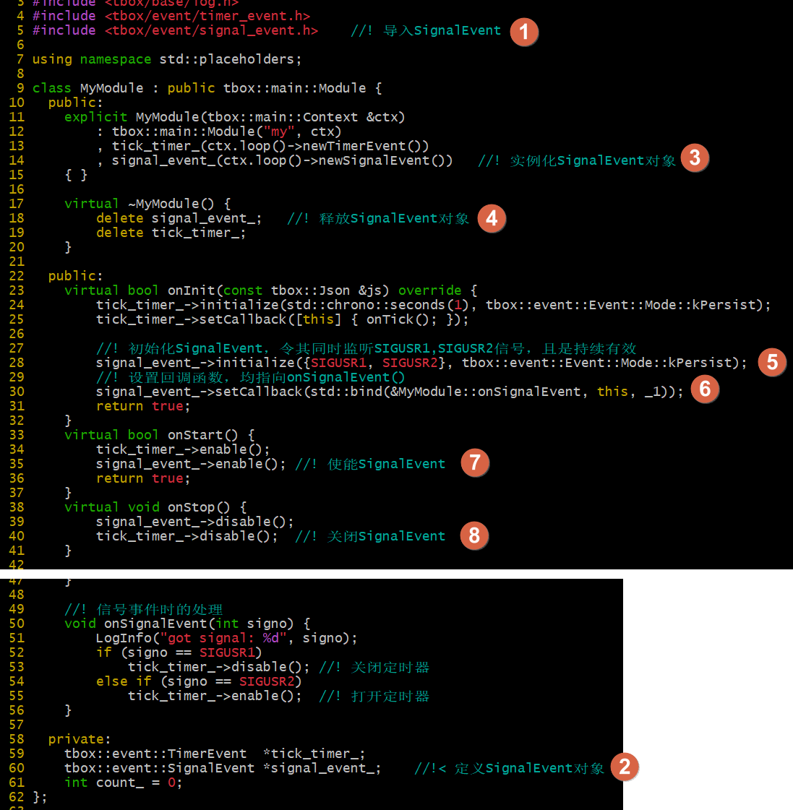
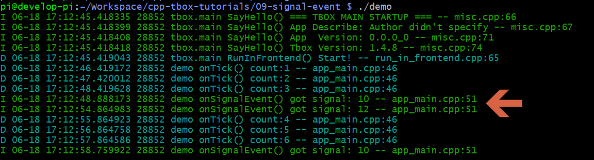

# 信号事件

写了Linux程序的同学都知道，当我们在终端按下ctrl+c的时候，系统会向进程序发送一个SIGINT的信号。如果我们在程序中`signal(SIGINT, xxxx)`注册了信号处理函数，那么该函数就会被调用。这种直接调`signal()`函数注册信号回调的方法其实是很不安全的。具体原因，网上有很多文章进行过阐述。在此就不在赘述。  
为了在tbox中能安全地使用信号，我为tbox中实现了另一种事件SignalEvent。使用它在tbox.main框架中注册信号回调是安全的。  

接下来，为了演示信号的使用，我们在定时器示例的基础上进行修改。当程序接收到信号USR1时停止定时器，当接收到信号USR2时启用定时器。  
代码如下：  

编译执行效果：  

