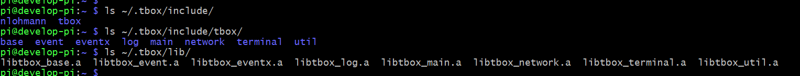
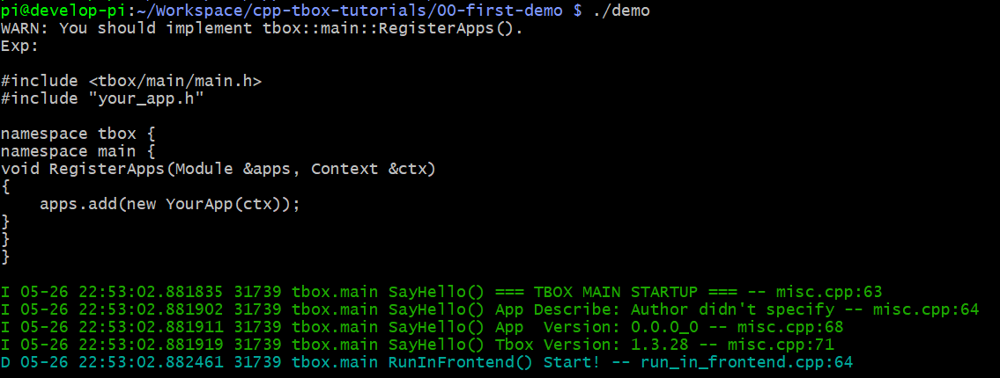
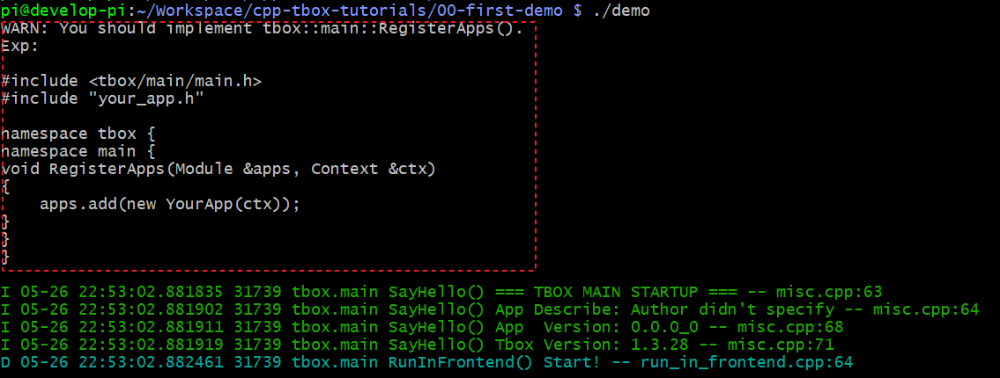
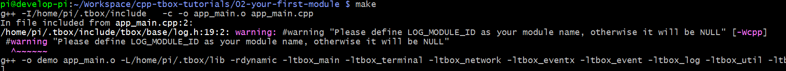
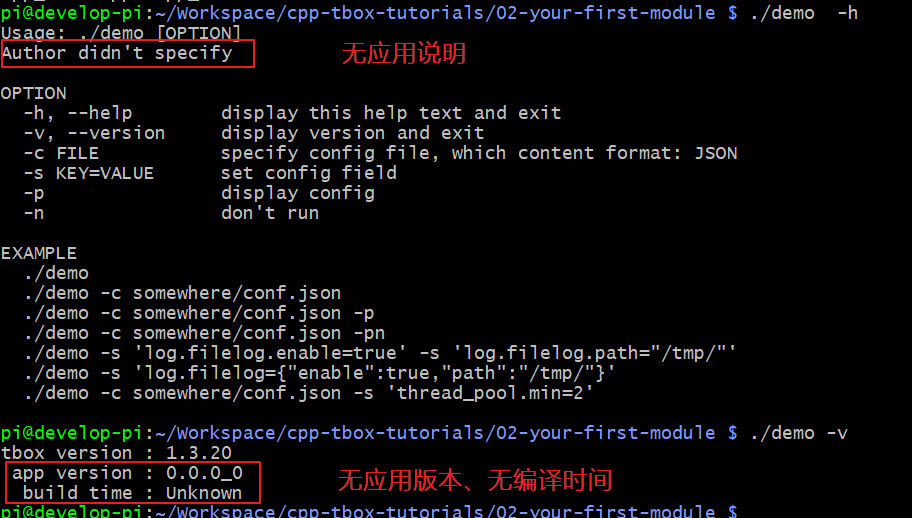
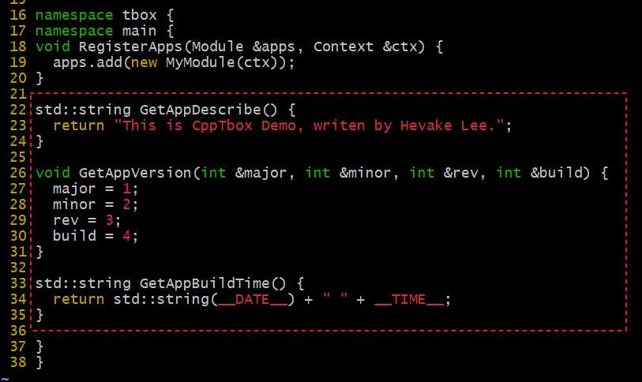
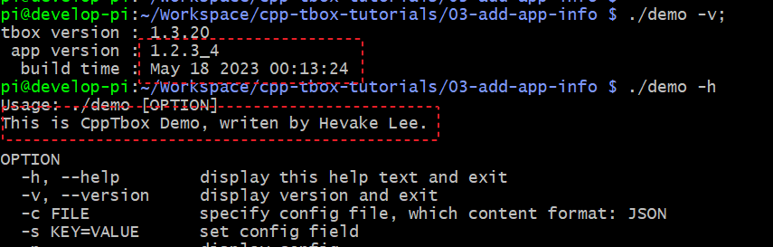
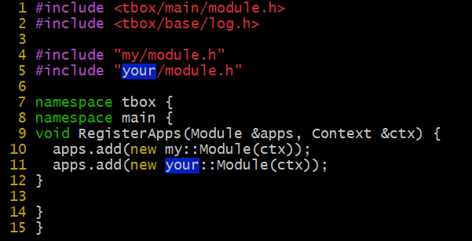
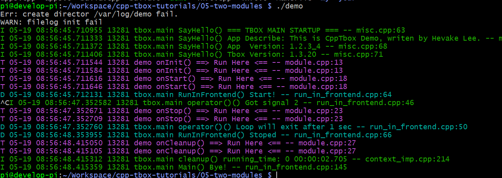

# CppTbox 的入门教程

本项目为 [cpp-tbox](https://gitee.com/cpp-master/cpp-tbox) 的入门教程。  
您可以通过下面一个个的教程逐步掌握 cpp-tbox 的使用。  

## 准备工作
下载与构建 cpp-tbox：
```
git clone https://gitee.com/cpp-master/cpp-tbox.git
cd cpp-tbox;
STAGING_DIR=$HOME/.tbox make 3rd-party modules RELEASE=1
```
完成之后，cpp-tbox 库产生的头文件在 ~/.tbox/include 路径下，库文件在 ~/.tbox/lib 路径下。  


## 第一个程序
创建自己的工程目录 00-first-demo，再在该目录下创建 Makefile 文件，内容如下:
```Makefile
TARGET:=demo

CXXFLAGS:=-I$(HOME)/.tbox/include
LDFLAGS:=-L$(HOME)/.tbox/lib -rdynamic
LIBS:=-ltbox_main -ltbox_terminal -ltbox_network -ltbox_eventx -ltbox_event -ltbox_log -ltbox_util -ltbox_base -lpthread -ldl

$(TARGET):
	g++ -o $(TARGET) $(LDFLAGS) $(LIBS)
```

[示例工程目录](00-first-demo)

然后执行 `make && ./demo`，效果:  


看到上面的显示，说明 ./demo 已经正常运行了。按 ctrl+c 可以正常退出程序。  
我们可以看到，我们的第一个程序就这么运行起来了。虽然我们什么代码都没有写，但它 tbox.main 框架自身是可以运行的。就像是一个只有火车头，没有车厢的火车一样。  

## 写一个自己的 Module
如果你很细心，你会发现上面的程序在运行之前有一堆提示:  
  
这是 tbox.main 框架在运行时，发现它没有任何可以运行的负载，向开发者打印的提示。  
它希望开发者自己去定义一个自己的模块，如 `YourApp`(名字开发者自己取)，然后按上面的方式注册到 tbox.main 框架上。  
接下来，我们按第一个课程的提示，编写自己的 `Module`。

创建 app\_main.cpp 文件，内容如下:  
```c++
#include <tbox/main/module.h>

class MyModule : public tbox::main::Module {
  public:
    explicit MyModule(tbox::main::Context &ctx) : tbox::main::Module("my", ctx) {}
};

namespace tbox {
namespace main {
void RegisterApps(Module &apps, Context &ctx) {
  apps.add(new MyModule(ctx));
}
}
}
```
然后再修改 Makefile，将 app\_main.cpp 加入到源文件中。  
见：[Makefile](01-first-module/Makefile)  

[示例工程目录](01-first-module)  

编译执行:`make && ./demo`，运行结果:  
   
这次可以看到，它没有再打印之前的提示了。说明我们写的`MyModule`已经生效了。

但是，单从日志上看，我们并不能看出我们写的 MyModule 有真的运行起来。  
接下来，我们再往 `MyModule` 中添加自定义的功能。让它在运行的过程中打印一点日志。    

[示例工程目录](02-first-module)  

```c++
class MyModule : public tbox::main::Module {
  public:
    explicit MyModule(tbox::main::Context &ctx) : tbox::main::Module("my", ctx) { }
    virtual ~MyModule() { }

    virtual bool onInit() override { LogTag(); }
    virtual bool onStart() override { LogTag(); }
    virtual void onStop() override { LogTag(); }
    virtual void onCleanup() override { LogTag(); }
};
```

我们重写了`MyModule`类的四个虚函数:`onInit()`，`onStart()`，`onStop()`，`onCleanup()`，并在每个虚函数中都添加了`LogTag()`日志打印。  
为了能使用`LogTag()`日志打印函数，我们还需要添加`#include <tbox/base/log.h>`。  
完成之后执行 `make`。在编译的时侯，我们看到了一条编译警告:   
  
它是在说我们程序没有指定日志的模块名。这仅是一条警告，我们可以忽略它。不过，我建议你在 Makefile 的`CXXFLAGS`定义中添加`-DLOG_MODULE_ID='"demo"'` 进行定义。  

编译后执行，然后按 ctrl+c 退出程序，完整的日志打印效果:  
    

可以看到，上面的出现了几条紫色的日志，这正是 LogTag() 打印的。  
在程序启动的时候，我们看到依次执行了`onInit()`与`onStart()`。在我们按 ctrl+c 时，程序退出时也依次执行了`onStop()`与`onCleanup()`。  
在真实的项目中，我们就通过重写 `tbox::main::Module` 中定义的虚函数与构造函数、析构函数来实现模块的功能的。  
我们需要在这些函数里实现什么功能呢?

| 函数 | 要实现的行为 | 注意事项 |
|:-|:-|:-|
| 构造函数 | 初始化自身的成员变量，包括new对象 | 不要做可能失败的行为。<br/>如果有，放到 `onInit()` 去做 |
| `onFillDefaultConfig()` | 往js对象中填写内容，填写本模块所需的默认参数 | 仅对 js 进行设置，不要做其它的事务 |
| `onInit()` | 根据js对象传入的参数，进行初始化本模块、与其它的模块建立关系、加载文件等 | 
| `onStart()` | 令模块开始工作 |  |
| `onStop()` | 令模块停止工作，是 `onStart()` 的逆过程 |  |
| `onCleanup()` | 解除与其它模块之间的联系、保存文件，是 `onInit()` 的逆过程 |  |
| 析构函数 | 释放资源、delete对象，是构造的逆过程 | 不要做有可能失败的行为。<br>如果有，放到 `onCleanup()` 去做 |

至于为什么要设计这四种虚函数，以及它们之间的差别，详见 [cpp-tbox/module/main/module.h](https://gitee.com/cpp-master/cpp-tbox/blob/master/modules/main/module.h) 中的解析。  

问：我看到上面有 `new MyModule(ctx)`，但我没有看到有对它的`delete`语句，是忘了写吗?  
答：tbox.main 架框会自己管理已注册`tbox::main::Module`派生类的生命期，一旦它被`add()`上去了，它的生命期就不需要开发者操心。

## 完善应用信息
上面，我们通过定义一个`MyModule`类，并重写其虚函数，实现了我们一个简单的应用。但仅仅是这么做是不完整的。  
当我们执行：`./demo -h` 时，当我们执行：`./demo -v` 或 `./demo --version` 时看到：  
  
这是因为，我们并没有对当前程序的描述、版本进行描述。我们可以通过在 app\_main.cpp 文件中加如下红框中的代码完善它：  
  
上面定义了三个函数：`GetAppDescribe()`、`GetAppVersion()`、`GetAppBuildTime()`，分析用于告析 tbox.main 框架当前应用的描述、版本号、编译时间点。  

[完整示例代码](03-add-app-info)

重新构建，再次执行 `./demo -v; ./demo -h` 效果：  


## 推荐的工程结构
在上面的示例中，我在 app_main.cpp 实现了所有的代码。而在真正的项目开发中，是不推荐这么做的。  
我们应该对 `app_main.cpp` 进行简单地拆分：  

- 将 `GetAppBuildTime()` 函数放到单独的文件中 build.cpp，并修改 Makefile 保证每次构建时，它都会被重新编译，以确保这个函数返回的时间与构建的时间一致；
- 将 `GetAppVersion()`, `GetAppDescribe()` 放置在 `info.cpp` 中，只要更新版本或应用描述才会改到它；
- 将 `RegisterApps()` 放置在 `apps.cpp` 中，以后基本不会再改它了；
- 创建你自己的应用目录，存放自定义的 `Module` 的实现，所有的业务相关的代码，都在这个目录下实现。

最终产生文件结构：  
```
.
├── apps.cpp    # 定义 RegisterApps()
├── build.cpp   # 定义 GetAppBuildTime()
├── info.cpp    # 定义 GetAppVersion(), GetAppDescribe()
├── Makefile
└── my          # 业务相关Module实现
    ├── app.mk
    ├── module.cpp
    └── module.h
```

[示例工程目录](04-normal-app-demo)

建议：在 my/ 目录下的所有代码，均以 `my` 作为顶层命名空间，以防在下一节的多Module情况下，命名空间污染。  

## 多个Module的工程结构
之前有提过：tbox.main 就像一个火车头。它可以像第一个示例所展示的那样，不带负载运行，也可以像上面一个示例所展示的那样，带一个负载运行。  
本小节将向你展示的是：它可以同时带多个负载运行。也就是说：一个 tbox.main 框架，可以同时将多个毫不相关的业务Module运行在同一个进程里，就像是一个火车头可同时拉多节车相一样。

接下来，我们在上一小节的基础上，再新增一个叫 "your" 的 Module，使之与之前叫 "my" 的 Module 一起运行在是一个进程里。  
步骤：
1. 将 my 目录复制为 your；
2. 进入 your，修改 module.cpp 与 module.h 将命名空间由 `my` 改成 `your`；
3. 打开 your/app.mk，将所有的 `my` 改成 `your`；
4. 打开 Makefile，在 `include my/app.mk` 下面添加 `include your/app.mk`；
5. 打开 apps.cpp，将所有`my`相关的都复制一份命名为`your`。  
  

最后工程文件结构如下：  
```
├── apps.cpp
├── build.cpp
├── info.cpp
├── Makefile
├── my
│   ├── app.mk
│   ├── module.cpp
│   └── module.h
└── your
    ├── app.mk
    ├── module.cpp
    └── module.h
```

[示例工程目录](05-two-modules)

构建后运行：  


## 日志的打印
调试日志是程序中一个比较重要的一部分。通常，我们在开发程序的时候，会直接使用 `printf()` 或 `std::cout`,`std::cerr` 在终端上打印日志。  
但这样打印，有很多不足：1）面日志格式混乱；2）能提供的调试信息不够充分；3）输出的方式太过单一；4）没有日志等级筛选功能。  
因为，我们会去寻找开源的日志系统库，如：glog, spdlog, cpp来满足日志打印需求。  

好在，当你使用 tbox.main 框架时，你根本就不需要为日志打印而发愁。它自带日志打印系统，你只要知道那几个打印函数。其它的都为你处理好了，你不需要关心。  
日志等机有：
|值|等级|名称|显示颜色|
|:-|:-|:-|:-|
|0|FATAL|代码错误|暗红|
|1|ERROR|错误|红|
|2|WARN|警告|黄|
|3|NOTICE|注意|淡黄|
|4|INFO|信息|绿|
|5|DEBUG|调试|淡蓝|
|6|TRACE|跟踪|紫|

日志打印函数有：  
|函数|等级|用途|
|:-|:-|:-|
|LogFatal(...)|FATAL|打印程序代码级的错误，比如：程序崩馈，通常不会使用到|
|LogErr(...)|ERROR|打印导致业务完全不可用的严重错误。区别于FATAL，指的是非程序级错误，比如配置文件打不开|
|LogWarn(...)|WARN|打印影响部分功能的错误。区别于ERROR，这种错误不整响主要功能|
|LogNotice(...)|NOTICE|打印外部因素引起的轻微异常，这种异常不会影响功能，但需要注意。如对方的协议格式错误、版本不一致|
|LogInfo(...)|INFO|打印与外部交互的信息，用于鉴别问题是外部的，还是内部的|
|LogDbg(...)|DEBUG|打印内部模块之间的信息，用于鉴别问题是属于内部的哪个模块的|
|LogTrace(...)|TRACE|打印临时查问题所需的日志信息|
|LogUndo(...)|NOTICE|标记有未实现的功能，通用创建一个空函数时，就会放置一个LogUndo()|
|LogTag()|TRACE|用于打印运行标记，观察程序有没有运行过标记位置|

下面，我们来实际操作一下。

## 参数系统
### 内置参数说明
### 实现自定义参数

## 终端

### 使能终端
### 内置命令介绍
### 实现自定义命令
### RPC

## 日志输出

## 主线程向线程池委派任务

## 子线程向主线程委派任务

## 定时器池使用

## 运行时异常捕获功能

## 多层级Module

## IO事件
### 写一个终端交互服务

## 定时器事件


## 信号事件

## HTTP模块

## 使用TcpServer模块写一个echo服务

## 使用TcpClient模块写一个客户端

## 使用TcpAcceptor + TcpConnection 实现echo服务

## 使用TcpConnector + TcpConnection 实现客户端

## 串口使用
### 写一个串口与终端的连接服务
### 写一个两个串口的连接服务
### 写一个串口转TCP的服务
