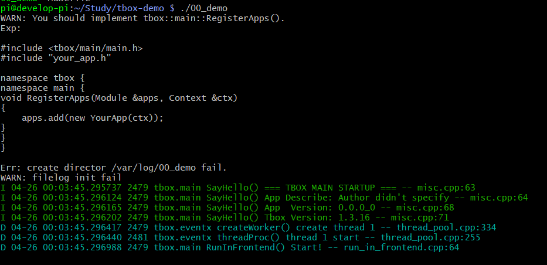

# CppTbox 的入门教程

本项目为 [cpp-tbox](https://gitee.com/cpp-master/cpp-tbox) 的入门教程。  
您可以通过下面一个个的教程逐步掌握 cpp-tbox 的使用。  

## 第一个程序
创建自己的工程目录,创建 Makefile。

Makefile
```
TARGET:=00_demo

CXXFLAGS:=-I$(HOME)/.tbox/include
LDFLAGS:=-L$(HOME)/.tbox/lib -rdynamic
LIBS:=-ltbox_main -ltbox_terminal -ltbox_network -ltbox_eventx -ltbox_event -ltbox_log -ltbox_util -ltbox_base -lpthread -ldl

$(TARGET):
	g++ -o $(TARGET) $(LDFLAGS) $(LIBS)
```

然后执行 `make && ./00_demo`,效果:


你可以看到，你的第一个程序就这么运行起来了。虽然你什么代码都没有写，但它 tbox 框架自身是可以运行的。就像是只有火车头，没有车厢的火车一样。  
注意看，你会发现程序在运行之前有一堆提示：
```
WARN: You should implement tbox::main::RegisterApps().
Exp:

#include <tbox/main/main.h>
#include "your_app.h"

namespace tbox {
namespace main {
void RegisterApps(Module &apps, Context &ctx)
{
    apps.add(new YourApp(ctx));
}
}
}

Err: create director /var/log/00_demo fail.
WARN: filelog init fail
```
这是 tbox 运行时，发现没有任何以在运行的负载，向开发者打印的提示。

## 写一个自己的 Module
接下来，我们按第一个课程的提示，编写自己的 `Module`。

## 日志打印

## 参数系统
### 内置参数说明
### 实现自定义参数

## 终端

### 使能终端
### 内置命令介绍
### 实现自定义命令
### RPC

## 日志输出

## 主线程向线程池委派任务

## 子线程向主线程委派任务

## 定时器池使用

## 运行时异常捕获功能

## 多层级Module

## IO事件
### 写一个终端交互服务

## 定时器事件


## 信号事件

## HTTP模块

## 使用TcpServer模块写一个echo服务

## 使用TcpClient模块写一个客户端

## 使用TcpAcceptor + TcpConnection 实现echo服务

## 使用TcpConnector + TcpConnection 实现客户端

## 串口使用
### 写一个串口与终端的连接服务
### 写一个两个串口的连接服务
### 写一个串口转TCP的服务
