# CppTbox 的入门教程

本项目为 [cpp-tbox](https://gitee.com/cpp-master/cpp-tbox) 的入门教程。  
您可以通过下面一个个的教程逐步掌握 cpp-tbox 的使用。  

## 准备工作
下载与构建 cpp-tbox：
```
git clone https://gitee.com/cpp-master/cpp-tbox.git
cd cpp-tbox;
make 3rd-party modules RELEASE=1 STAGING_DIR=$HOME/.tbox
```
完成之后，cpp-tbox 库产生的头文件在 ~/.tbox/include 路径下，库文件在 ~/.tbox/lib 路径下。  


## 第一个程序
创建自己的工程目录 00-first-demo，再在该目录下创建 Makefile 文件，内容如下:
```Makefile
TARGET:=demo

CXXFLAGS:=-I$(HOME)/.tbox/include
LDFLAGS:=-L$(HOME)/.tbox/lib -rdynamic
LIBS:=-ltbox_main -ltbox_terminal -ltbox_network -ltbox_eventx -ltbox_event -ltbox_log -ltbox_util -ltbox_base -lpthread -ldl

$(TARGET):
	g++ -o $(TARGET) $(LDFLAGS) $(LIBS)
```

[示例工程目录](00-first-demo)

然后执行 `make && ./demo`，效果:  


看到上面的显示，说明 ./demo 已经正常运行了。按 ctrl+c 可以正常退出程序。  
我们可以看到，我们的第一个程序就这么运行起来了。虽然我们什么代码都没有写，但它 tbox.main 框架自身是可以运行的。就像是一个只有火车头，没有车厢的火车一样。  

## 写一个自己的 Module
如果你很细心，你会发现上面的程序在运行之前有一堆提示:  
  
这是 tbox.main 框架在运行时，发现它没有任何可以运行的负载，向开发者打印的提示。  
它希望开发者自己去定义一个自己的模块，如 `YourApp`(名字开发者自己取)，然后按上面的方式注册到 tbox.main 框架上。  
接下来，我们按第一个课程的提示，编写自己的 `Module`。

创建 app\_main.cpp 文件，内容如下:  
```c++
#include <tbox/main/module.h>

class MyModule : public tbox::main::Module {
  public:
    explicit MyModule(tbox::main::Context &ctx) : tbox::main::Module("my", ctx) {}
};

namespace tbox {
namespace main {
void RegisterApps(Module &apps, Context &ctx) {
  apps.add(new MyModule(ctx));
}
}
}
```
然后再修改 Makefile，将 app\_main.cpp 加入到源文件中。  
见：[Makefile](01-first-module/Makefile)  

[示例工程目录](01-first-module)  

编译执行:`make && ./demo`，运行结果:  
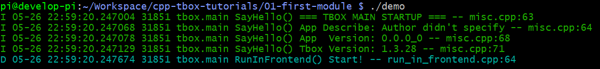   
这次可以看到，它没有再打印之前的提示了。说明我们写的`MyModule`已经生效了。

但是，单从日志上看，我们并不能看出我们写的 MyModule 有真的运行起来。  
接下来，我们再往 `MyModule` 中添加自定义的功能。让它在运行的过程中打印一点日志。    

[示例工程目录](02-first-module)  

```c++
class MyModule : public tbox::main::Module {
  public:
    explicit MyModule(tbox::main::Context &ctx) : tbox::main::Module("my", ctx) { }
    virtual ~MyModule() { }

    virtual bool onInit() override { LogTag(); }
    virtual bool onStart() override { LogTag(); }
    virtual void onStop() override { LogTag(); }
    virtual void onCleanup() override { LogTag(); }
};
```

我们重写了`MyModule`类的四个虚函数:`onInit()`，`onStart()`，`onStop()`，`onCleanup()`，并在每个虚函数中都添加了`LogTag()`日志打印。  
为了能使用`LogTag()`日志打印函数，我们还需要添加`#include <tbox/base/log.h>`。  
完成之后执行 `make`。在编译的时侯，我们看到了一条编译警告:   
  
它是在说我们程序没有指定日志的模块名。这仅是一条警告，我们可以忽略它。不过，我建议你在 Makefile 的`CXXFLAGS`定义中添加`-DLOG_MODULE_ID='"demo"'` 进行定义。  

编译后执行，然后按 ctrl+c 退出程序，完整的日志打印效果:  
    

可以看到，上面的出现了几条紫色的日志，这正是 LogTag() 打印的。  
在程序启动的时候，我们看到依次执行了`onInit()`与`onStart()`。在我们按 ctrl+c 时，程序退出时也依次执行了`onStop()`与`onCleanup()`。  
在真实的项目中，我们就通过重写 `tbox::main::Module` 中定义的虚函数与构造函数、析构函数来实现模块的功能的。  
我们需要在这些函数里实现什么功能呢?

| 函数 | 要实现的行为 | 注意事项 |
|:-|:-|:-|
| 构造函数 | 初始化自身的成员变量，包括new对象 | 不要做可能失败的行为。<br/>如果有，放到 `onInit()` 去做 |
| `onFillDefaultConfig()` | 往js对象中填写内容，填写本模块所需的默认参数 | 仅对 js 进行设置，不要做其它的事务 |
| `onInit()` | 根据js对象传入的参数，进行初始化本模块、与其它的模块建立关系、加载文件等 | 
| `onStart()` | 令模块开始工作 |  |
| `onStop()` | 令模块停止工作，是 `onStart()` 的逆过程 |  |
| `onCleanup()` | 解除与其它模块之间的联系、保存文件，是 `onInit()` 的逆过程 |  |
| 析构函数 | 释放资源、delete对象，是构造的逆过程 | 不要做有可能失败的行为。<br>如果有，放到 `onCleanup()` 去做 |

至于为什么要设计这四种虚函数，以及它们之间的差别，详见 [cpp-tbox/module/main/module.h](https://gitee.com/cpp-master/cpp-tbox/blob/master/modules/main/module.h) 中的解析。  

Q：我看到上面有 `new MyModule(ctx)`，但我没有看到有对它的`delete`语句，是忘了写吗?  
A：tbox.main 架框会自己管理已注册`tbox::main::Module`派生类的生命期，一旦它被`add()`上去了，它的生命期就不需要开发者操心。

## 日志的打印
调试日志是程序中一个比较重要的一部分。通常，我们在开发程序的时候，会直接使用 `printf()` 或 `std::cout`,`std::cerr` 在终端上打印日志。但这样打印，有很多不足：1）面日志格式混乱；2）能提供的调试信息不够充分；3）输出的方式太过单一；4）没有日志等级筛选功能。  
因此，我们会去寻找开源的日志系统库，如：spdlog, glog, log4cxx，来满足日志打印需求。  

好在，当你使用 tbox.main 框架时，你根本就不需要为日志打印而发愁，因为它自带日志打印系统。你直接用就可以了。其它的不需要你关心。  

日志等级有：  
|值|等级|名称|显示颜色|
|:-|:-|:-|:-|
|0|FATAL|代码错误|暗红|
|1|ERROR|错误|红|
|2|WARN|警告|黄|
|3|NOTICE|注意|淡黄|
|4|INFO|信息|绿|
|5|DEBUG|调试|淡蓝|
|6|TRACE|跟踪|紫|

日志打印函数有：  
|函数|等级|用途|
|:-|:-|:-|
|`LogFatal(fmt,...)`|FATAL|打印程序代码级的错误，比如：程序崩馈，通常不会使用到|
|`LogErr(fmt,...)`|ERROR|打印导致业务完全不可用的严重错误。区别于FATAL，指的是非程序级错误，比如配置文件打不开|
|`LogWarn(fmt,...)`|WARN|打印影响部分功能的错误。区别于ERROR，这种错误不整响主要功能|
|`LogNotice(fmt,...)`|NOTICE|打印外部因素引起的轻微异常，这种异常不会影响功能，但需要注意。如对方的协议格式错误、版本不一致|
|`LogInfo(fmt,...)`|INFO|打印与外部交互的信息，用于鉴别问题是外部的，还是内部的|
|`LogDbg(fmt,...)`|DEBUG|打印内部模块之间的信息，用于鉴别问题是属于内部的哪个模块的|
|`LogTrace(fmt,...)`|TRACE|打印临时查问题所需的日志信息|
|`LogUndo()`|NOTICE|标记有未实现的功能，通用创建一个空函数时，就会放置一个LogUndo()|
|`LogTag()`|TRACE|用于打印运行标记，观察程序有没有运行过标记位置|
|`LogPrintf(level,fmt,...)`||在参数中指定等级打印格式化日志|
|`LogPuts(level,text)`||在参数中指定等级打印字符串日志|

详见 [log.h](https://gitee.com/cpp-master/cpp-tbox/blob/master/modules/base/log.h)

下面，我们来实际操作一下，在MyModule的onInit()尝试所有的日志打印函数：  
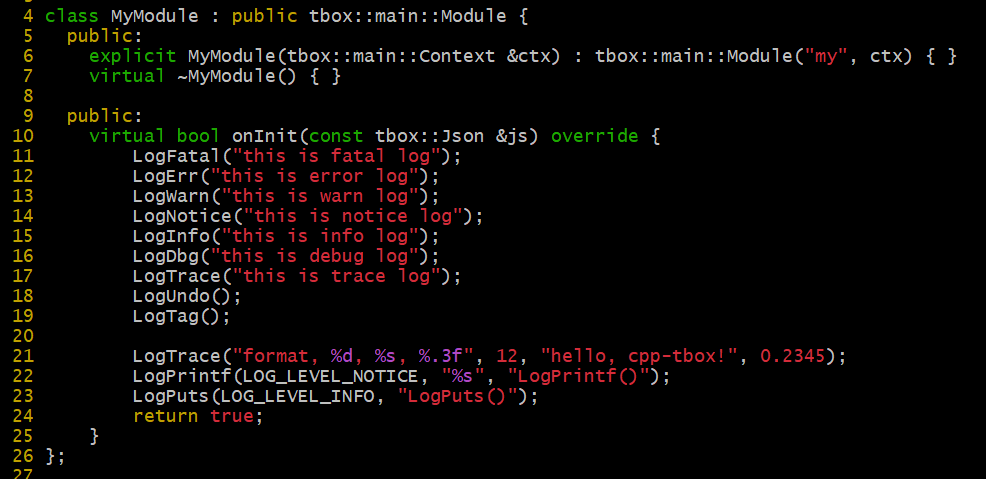

[示例工程目录](06-log-print/)  

编译执行效果：  
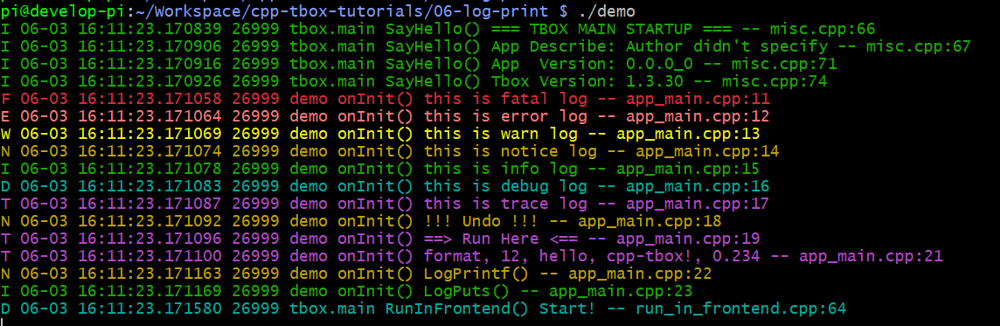

只要运行，我们就能在终端上就可以看到日志打印了。  
与常规的日志打印一样，一条日志记录打印一行。每一条记录都有以下信息：  
  
日志的时间点精确到微秒，有线程号，函数名、文件及行号，对调试非常有帮助。

Q: 日志除了打印到终端，还能输出到别的地方吗？  
A: 日志系统有三种输出方式：stdout(终端)、syslog、file。在不指定的情况下，默认只输出到stdout。如果需要，可以通过参数分别对这三种输出方式进行配置。这个后面讲参数的时候详细介绍。

## 事件驱动模式的编程
在上面的教程中，我们创建了第一个自己模块`MyModule`，我们只需要重写它的`onInit()`,`onStart()`,`onStop()`,`onCleanup()`就可以实现所有的业务功能。这对第一次接触网络编程的同学会比较陌生。  

在传统的开发中，我们是需要创建很多线程来实现与外部交互的功能的。  
比如：读写串口，我们要创建两个线程。其中一个专门负责读串口设备文件，将读到的数据写入到一个读队列里，再由业务线程去处理。再创建一个线程，负责从发送队列里取出要发送数据，并写到串口设备文件中。如果同时管理N个串口，那么就需要创建2N个线程。如果是一个网络通信的服务程序，要为每一个socket创建一个读线程。  
这无疑增加了内存资源与CPU资源的消耗，同时要管理多线程之间的资源访问，避免竞态。如果在加锁上出现纰漏，多线程出现访问竞态，会出现很多偶发性bug，很不好查。采用这样的编程模式会很令人心身疲惫。

tbox采用的是传统的网络编程模式：Reactor。关于 Reactor 我们可以在网上找到很多资料，笔者就不再在此赘述了。  
tbox.main 框架主要借鉴了 [Node.js](https://nodejs.org/zh-cn) 的思想。采用：**Reactor线程 + 线程池** 的结构。  

- Reactor线程：采用多路复用模型，处理所有的事件；
- 线程池：辅助执行阻塞性的函数调用、与大运算；

Reactor线程就像是一个银行的办事柜台。如果遇到很轻松就能完成的事务，比如查询余额，柜台工作人员就立即处理了。如果遇到的是比较繁重的工作，比如大额的取款，柜台工作人员便令后面的工作人员进行操作，让顾客在休息区等待。柜台工作人员则继续接待其它的顾客。等后面的工作人员取出了大金额的现金后，柜台工作人员呼叫取钱的顾客，并将现金给到该顾客。  
这个过程中，柜台工作人员就是Reactor线程，后面的工作人员就是线程池的工作线程。查询余额则是非阻塞性任务，取大额现金则是阻塞性的任务。

在 tbox.main 框架编程中，一切都是基于事件驱动的。具体操作就是：向Reactor注册某个事件的回调函数。当该事件发生了，Reactor就会回调之前注册的函数。  
这种模型对注册的回调函数有三个基本的要求：**不要阻塞！不要阻塞！不要阻塞！**。  
大家可以拜读一下 Node.js 的官方文档《[不要阻塞事件循环](https://nodejs.org/zh-cn/docs/guides/dont-block-the-event-loop)》，咱们的 cpp-tbox 与 Node.js 的机制是一样的，原理也是相通的。

基于这个要求：

- 所有的回调事务要尽快完成，时间消耗要限制在1ms以内；
- 不要执行读写文件的操作，如果需要，移交给线程池去做；
- 不要进行大规模运算，如果需要，移交给线程池去做。

## 定时器事件
在基于事件的编程中，sleep() 或 delay() 这类阻塞性的函数是不能使用的。替而代之的是定时器。  
定时器，是基于事件编程中常见的组件。它可以实现：  

- 每间隔指定时间执行指定的动作；
- 指定时间后执行指定的动作；

在 tbox.main 框架中，我们自己的模块可以通过构造通传入的 `ctx` 获取 `event::Loop` 对象。而 `event::Loop` 对象可以创建定时器事件、IO事件、信号事件。  

接下来，我们实现一个定时器的功能：
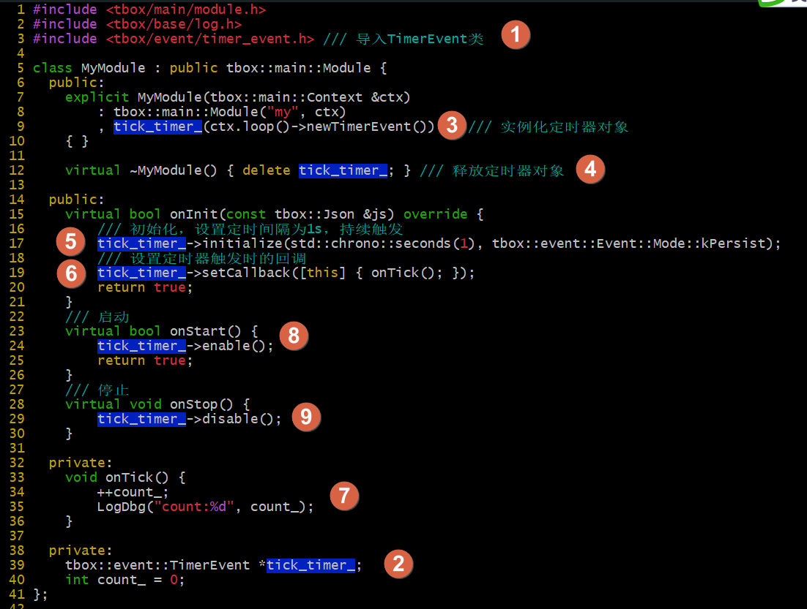  

实现步骤：  
(1) 包含头文件；  
(2) 添加成员变量 `tick_timer_` 用于存放定时器对象；  
(3) 在构造函数中实例化定时器对象；  
(4) 在析构函数中释放定时器对象；  
(5) 在 `onInit()` 中对定时器对象进行初始化，定时间隔1秒，持续触发；  
(6) 设置定时器的回调函数；  
(7) 实现 `onTick()` 函数；  
(8) 在 `onStart()` 中启动定时器；  
(9) 在 `onStop()` 中停止定时器；  

[示例工程目录](07-timer-event)  

编译后，执行效果：
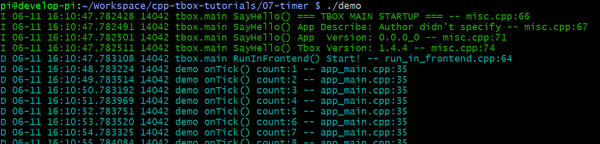  
可以看到定时器有定时触发。

如果想实现单次定时，将 L17 `initialize()` 的最后一个参数的 `kPersist` 改成 `kOneshot` 即可。

## IO事件
在基于事件的开发中，除了定期触发的事件，更多的是当外部发生了某件事件从而引发的事件。这些事件通常是通过文件描述符的可读可写时事件触发的。  
在 tbox 中，除了 TimerEvent，还有更重要的一种事件：FdEvent。它用于监听某个文件描述符的可读可写事件。  

下面，我们对上面的定时器时示例添加新的功能：当我们在终端上输入"off"时关闭定时器，当我们输入"on"打开定时器。  
为了实现这个功能，首先我们要实现从终端获取输入的数据。  
问：使用 `std::cin` 可以吗？这可是传统的方式。答：不可以，因为它是阻塞的。还记得我们前面提过 **不要阻塞** 的要求吗？所以不行。  
问：那开一个线程专门负责读终端的终入，将去控制定时器行不行呢？答：这也不是不行，只是这样就需要额外开一个线程了。  
这里，我们采用另一种更优的方案：创建一个stdin的文件描述符的`FdEvent`，令其监听stdin的可读事件。当stdin可读时，就调用`read(0,xx,yy)`将数据读出来，再处理。这样就不会阻塞了。  
如下更改：  
  
在(9)处定义了接收到stdin输入的处理过程。首先，检查一下是不是可读事件，如果是才处理。然后读0文件描述符，即stdin。将数据读到`buff`缓冲中。最后，根据输入的内容进行处理。

[示例工程目录](08-fd-event)

编译执行效果：  
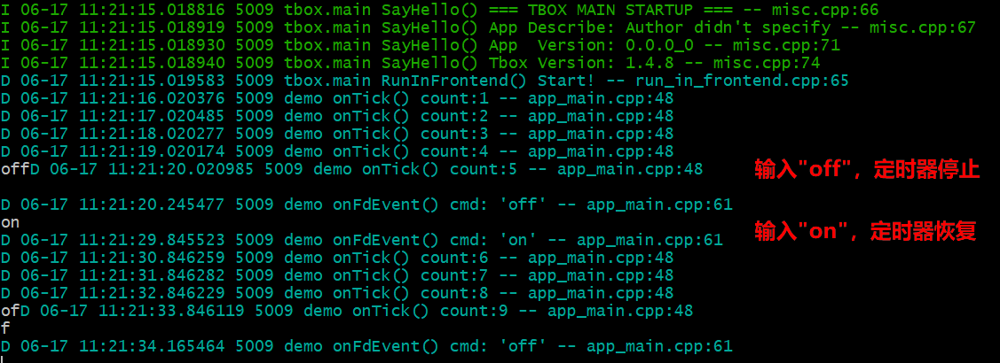  

## 信号事件
写了Linux程序的同学都知道，当我们在终端按下ctrl+c的时候，系统会向进程序发送一个SIGINT的信号。如果我们在程序中`signal(SIGINT, xxxx)`注册了信号处理函数，那么该函数就会被调用。这种直接调`signal()`函数注册信号回调的方法其实是很不安全的。具体原因，网上有很多文章进行过阐述。在此就不在赘述。  
为了在tbox中能安全地使用信号，我为tbox中实现了另一种事件SignalEvent。使用它在tbox.main框架中注册信号回调是安全的。  

接下来，为了演示信号的使用，我们在定时器示例的基础上进行修改。当程序接收到信号USR1时停止定时器，当接收到信号USR2时启用定时器。  
代码如下：  


编译执行效果：  


## HTTP服务
上面，我们分别演示了定时器事件`TimerEvent`、文件描述符事件`FdEvent`，以及信号事件`SignalEvent`的使用方式。然而，在真实的开发中，我们会优先使用tbox内部为我们实现的模块来实现我们的功能，比如：`TcpServer`, `TcpClient`, `Uart`, `BufferedFd`。这些模块的本质是在内部封装了对`TimerEvent`,`FdEvent`,`SignalEvent`的操作。  
下面，我们使用`http`模块来实现一个简单的http服务器。

由于tbox中的`http`模块不是默认开启的。我们需要通过修改`config.mk`文件打开它，并构建：  
  
然后再执行命令：`make 3rd-party modules RELEASE=1 STAGING_DIR=$HOME/.tbox`，进行构建：  
  
看到上面的输出，表示构建完成。接下来就可以使用 http 模块了。

为了演示，我们写一个非常简单的http服务程序，当我们访问它的时候，显示hello页面。  
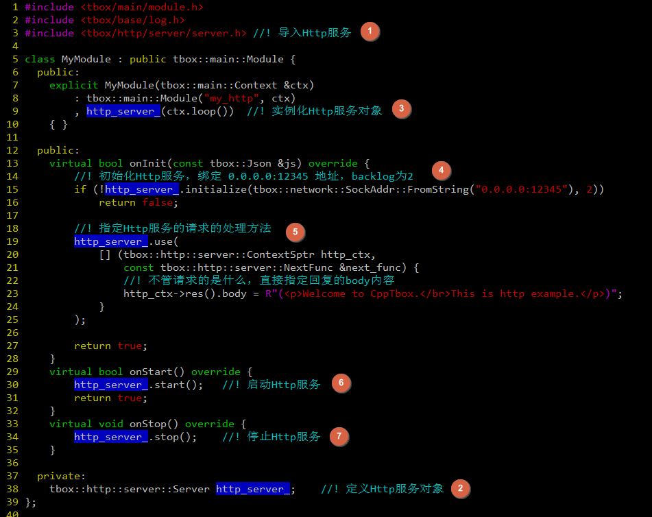  

[示例程序目录](10-tiny-http-server)

编译执行，使用 curl 测试，结果如下：  
  
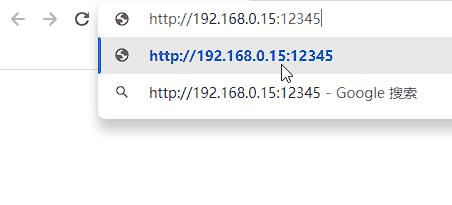  

## 参数系统
参数可以用于不修改代码的情况下改变程序的行为。常规的参数传入有两种方式：(1)环境变量；(2)命令参数。而命令参数是用得最多的。  
在常规的开发中，我们可能这样传入命令参数的：  
```c
int main(int argc, char **argv) {
    if (argc >= 2) {
        ... /// 解析 argc 与 argv
    }
}
```
如果直接这么写会很麻烦，通常我们会使用 `getopt()` 或是 `getopt_long()` 来辅助解析。不过这还是会比较繁琐。每个要传入的参数都得写解析代码，而每个程序要传入的参数还各不相同。这样一来，每开发一个程序都要重写一次参数解析模块，每添加或删除参数也要修改，也比较繁琐。  
好在我们的tbox.main框架中内置了一套开放性的参数系统。它允许程序传入任何类型的参数（字串、数值、数组、对象），而且还支持将参数以配置文件的形式进行导入，让传参变得非常简单。本节我们将通过一系列的例子学习它的使用。  

### 实现自定义参数
在上面的http示例中，我们在 `onInit()` 中对http_server_对象进行了初始化，令其固定绑定 0.0.0.0 地址与12345端口，且backlog指定为2。将这些初始化参数写死在程序里不是一个好的主意。因为在真实的项目中，这些常常会变更。  
接下来，我们将使用参数系统，将绑定地址与端口，还以backlog通过参数传入。  

### 内置参数说明
上面，我们认识到了参数系统的灵活性。除了我们自定义自己业务相关的参数，还有很多tbox.main内置的参数。我们可以通过修改它们来改变tbox.main的行为。

## 终端
### 使能终端
### 实现自定义命令
### 内置命令介绍
### RPC接口

## 日志输出

## 线程池的使用

## 子线程向主线程委派任务

## 定时器池使用

## 运行时异常捕获功能

## 多层级Module

## 使用TcpServer模块写一个echo服务

## 使用TcpClient模块写一个客户端

## 使用TcpAcceptor + TcpConnection 实现echo服务

## 使用TcpConnector + TcpConnection 实现客户端

## 串口使用
### 写一个串口与终端的连接服务
### 写一个两个串口的连接服务
### 写一个串口转TCP的服务

## 完善应用信息
上面，我们通过定义一个`MyModule`类，并重写其虚函数，实现了我们一个简单的应用。但仅仅是这么做是不完整的。  
当我们执行：`./demo -h` 时，当我们执行：`./demo -v` 或 `./demo --version` 时看到：  
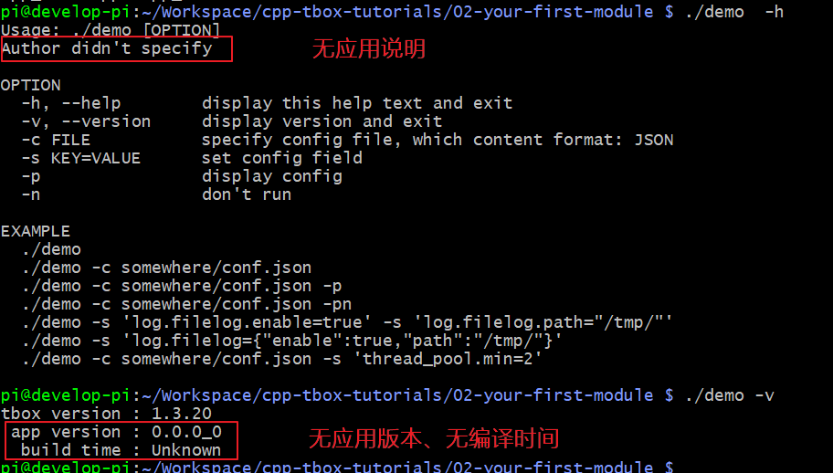  
这是因为，我们并没有对当前程序的描述、版本进行描述。我们可以通过在 app\_main.cpp 文件中加如下红框中的代码完善它：  
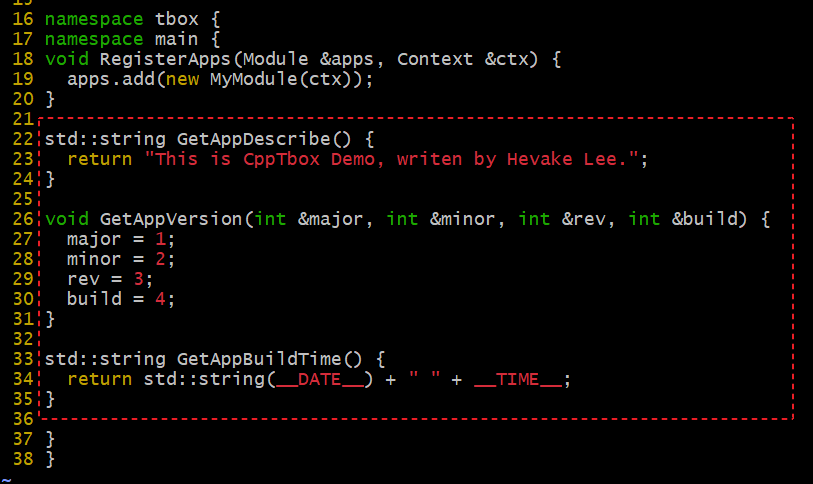  
上面定义了三个函数：`GetAppDescribe()`、`GetAppVersion()`、`GetAppBuildTime()`，分析用于告析 tbox.main 框架当前应用的描述、版本号、编译时间点。  

[完整示例代码](03-add-app-info)

重新构建，再次执行 `./demo -v; ./demo -h` 效果：  


## 推荐的工程结构
在上面的示例中，我在 app_main.cpp 实现了所有的代码。而在真正的项目开发中，是不推荐这么做的。  
我们应该对 `app_main.cpp` 进行简单地拆分：  

- 将 `GetAppBuildTime()` 函数放到单独的文件中 build.cpp，并修改 Makefile 保证每次构建时，它都会被重新编译，以确保这个函数返回的时间与构建的时间一致；
- 将 `GetAppVersion()`, `GetAppDescribe()` 放置在 `info.cpp` 中，只要更新版本或应用描述才会改到它；
- 将 `RegisterApps()` 放置在 `apps.cpp` 中，以后基本不会再改它了；
- 创建你自己的应用目录，存放自定义的 `Module` 的实现，所有的业务相关的代码，都在这个目录下实现。

最终产生文件结构：  
```
.
├── apps.cpp    # 定义 RegisterApps()
├── build.cpp   # 定义 GetAppBuildTime()
├── info.cpp    # 定义 GetAppVersion(), GetAppDescribe()
├── Makefile
└── my          # 业务相关Module实现
    ├── app.mk
    ├── module.cpp
    └── module.h
```

[示例工程目录](04-normal-app-demo)

建议：在 my/ 目录下的所有代码，均以 `my` 作为顶层命名空间，以防在下一节的多Module情况下，命名空间污染。  

## 多个Module的工程结构
之前有提过：tbox.main 就像一个火车头。它可以像第一个示例所展示的那样，不带负载运行，也可以像上面一个示例所展示的那样，带一个负载运行。  
本小节将向你展示的是：它可以同时带多个负载运行。也就是说：一个 tbox.main 框架，可以同时将多个毫不相关的业务Module运行在同一个进程里，就像是一个火车头可同时拉多节车相一样。

接下来，我们在上一小节的基础上，再新增一个叫 "your" 的 Module，使之与之前叫 "my" 的 Module 一起运行在是一个进程里。  
步骤：
1. 将 my 目录复制为 your；
2. 进入 your，修改 module.cpp 与 module.h 将命名空间由 `my` 改成 `your`；
3. 打开 your/app.mk，将所有的 `my` 改成 `your`；
4. 打开 Makefile，在 `include my/app.mk` 下面添加 `include your/app.mk`；
5. 打开 apps.cpp，将所有`my`相关的都复制一份命名为`your`。  
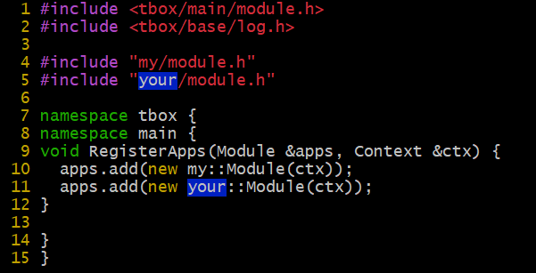  

最后工程文件结构如下：  
```
├── apps.cpp
├── build.cpp
├── info.cpp
├── Makefile
├── my
│   ├── app.mk
│   ├── module.cpp
│   └── module.h
└── your
    ├── app.mk
    ├── module.cpp
    └── module.h
```

[示例工程目录](05-two-modules)

构建后运行：  
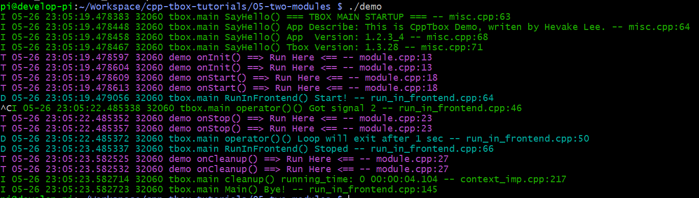
